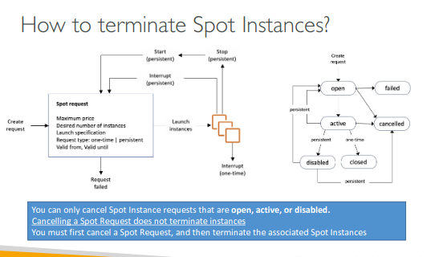
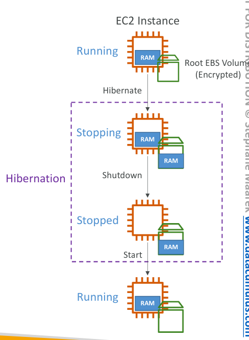
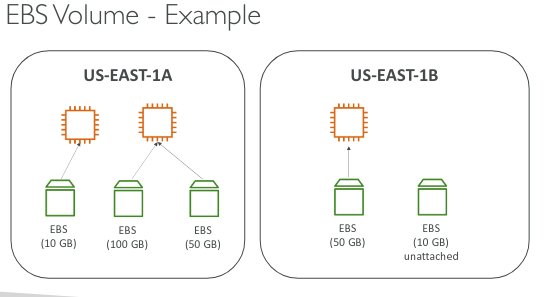

## Fundamentals

  

- EC2
    - EC2 = Elastic Compute Cloud = Infrastructure as a Service
    - It mainly consists of the capability of :
        - Renting virtual machines (EC2)
        - Storing data on virtual drives (EBS)
        - Distributing load across machines (ELB)
        - Scaling the services using an auto-scaling group (ASG)
- Sizing and configuration
    
    - Operating System (OS): Linux,Windows or Mac OS
    - How much compute power & core (CPU)?
    - How much random access memory (RAM)?
    - How much storage space:
        - 1. Network-attached (EBS & EFS)
        - 2. hardware (EC2 Instance Store).
    - Network card: speed of the card, public IP address.
    - Firewall rules: Security group.
    - Bootstrap script (configured at first launch ): EC2 User Data.
    - Overview:
        - OS
        - CPU
        - RAM
        - Storage
        - Network
        - Firewall
        - Scripts.
    
      
    
- EC2 User Data
    - **EC2 User Data**: You can provide scripts or commands that run when an EC2 instance is launched or rebooted.
    - **Automation**: Commonly used to automate software installations, updates, or instance configuration at startup.
    - **Script Format**: Typically a shell script (`#!/bin/bash` for Linux) or PowerShell script (`#!/PowerShell` for Windows).
    - **Package Installation**: You can install and update packages during instance initialization (e.g., `yum install`, `apt-get update`).
    - **Service Setup**: Used to start services (like Apache, and Docker) and enable them to run at boot.
    - **Custom Configurations**: Useful for custom configurations such as setting up environment variables, copying files, or starting applications.
    - **Availability**: This can be passed via AWS Management Console, AWS CLI, or SDKs.
    - **Log File**: Check `/var/log/cloud-init-output.log` on Linux instances for execution details and troubleshooting.
- EC2 Instance Types
    
    - EC2 instance types offer varying CPU, memory, storage, and networking combinations, allowing you to choose the best mix for your application’s needs. This flexibility ensures optimal performance and cost-efficiency.
    - Here are the 8 main types of EC2 instance categories:
        1. **General Purpose**: Balanced CPU, memory, and networking (e.g., t3, m6g).
        2. **Compute Optimized**: High CPU for compute-heavy tasks (e.g., c6g, c7g).
        3. **Memory Optimized**: High memory for large in-memory workloads (e.g., r6g, x2idn).
        4. **Storage Optimized**: Fast storage for data-intensive applications (e.g., i4i, d3en).
        5. **Accelerated Computing**: GPUs, FPGAs for AI/ML, graphics, etc. (e.g., p4d, inf1).
        6. **High Performance Computing (HPC)**: Specialized for high-performance computing workloads (e.g., hpc6a).
        7. **Burstable Performance**: Provides baseline CPU performance with the ability to burst (e.g., t3, t4g).
        8. **Bare Metal**: Direct hardware access for special use cases (e.g., i3.metal, c5.metal).
    
    [](https://docs.aws.amazon.com/images/ec2/latest/instancetypes/images/instance-type-naming-convention.png)
    
- Security Groups
    
    - It is fundamental to network security in AWS.
    - they control how the traffic is allowed in and out of the ec2 instances.
    - it only contains allowed rules and can be referenced by IP or by security group
    - they act as a firewall on ec2.
    - it contains :
        - ports
        - IP range (ipv4 or ipv6)
        - inbound [ from other to the ec2 ]
        - outbound [ from ec2 to other ]
    - Classic Ports :
        - 22 ⇒ SSH (Secure Shell) → log into a Linux instance
        - 21 ⇒ FTP (FileTransfer Protocol) → upload files into a file share
        - 22 ⇒ SFTP (Secure FileTransfer Protocol) → upload files using SSH
        - 80 ⇒ HTTP → access unsecured websites
        - 443 ⇒ HTTPS → access secured websites
        - 3389 ⇒ RDP (Remote Desktop Protocol) → log into a Windows instance
    
- Instance role
    - An **IAM role** in AWS is a set of permissions assigned to AWS resources, like EC2 instances, to securely access other services without using long-term credentials. It provides temporary, controlled access based on assigned policies.
    - Example:
        - Here's a simplified guide to creating and attaching an IAM role to an EC2 instance:
            
            1. **Create IAM Role**:
                - Go to the [IAM Console](https://console.aws.amazon.com/iam/), select **Roles**, and click **Create role**.
                - Choose **EC2** as the trusted entity.
                - Attach necessary policies (e.g., `AmazonS3FullAccess`).
                - Name the role and click **Create role**.
            2. **Attach Role to EC2 Instance**:
                - In the [EC2 Console](https://console.aws.amazon.com/ec2/), select your instance.
                - Click **Actions** > **Security** > **Modify IAM Role**.
                - Select your role and update it.
            
            This allows your instance to use the permissions without managing credentials.
            
- EC2 Instances Purchasing Options
    
    - On-Demand Instances – short workload, predictable pricing, pay by second
        
        - Pay for what you use:
            - Linux or Windows - billing per second, after the first minute
            - All other operating systems - billing per hour
        - Has the highest cost but no upfront payment
        - No long-term commitment
        - Recommended for short-term and un-interrupted workloads, where
        
        you can't predict how the application will behave
        
    - Reserved (1 & 3 years)
        - Reserved Instances – long workloads
            - Up to 72% discount compared to On-demand
            - You reserve specific instance attributes (Instance Type, Region, Tenancy, OS)
            - Reservation Period – 1 year (+discount) or 3 years (+++discount)
            - Payment Options – No Upfront (+), Partial Upfront (++), All Upfront (+++)
            - Reserved Instance’s Scope – Regional or Zonal (reserve capacity in an AZ)
            - Recommended for steady-state usage applications (think database)
            - You can buy and sell in the Reserved Instance Marketplace
        - Convertible Reserved Instances – long workloads with flexible instances
            - Can change the EC2 instance type, instance family, OS, scope, and tenancy
            - Up to 66% discount
    - Savings Plans (1 & 3 years) –the commitment to an amount of usage, long workload
        - Get a discount based on long-term usage (up to 72% - same as RIs)
        - Commit to a certain type of usage ($10/hour for 1 or 3 years)
        - Usage beyond EC2 Savings Plans is billed at the On-Demand price
        - Locked to a specific instance family & AWS region (e.g., M5 in us-east-1)
        - Flexible across:
        - Instance Size (e.g., m5.xlarge, m5.2xlarge)
        - OS (e.g., Linux, Windows)
        - Tenancy (Host, Dedicated, Default)
    - Spot Instances – short workloads, cheap, can lose instances (less reliable)
        - You can get a discount of up to 90% compared to On-demand
        - Instances that you can “lose” at any point in time if your max price is less than the current spot price
        - The MOST cost-efficient instances in AWS
        - Useful for workloads that are resilient to failure•Batch jobs
        - Data analysis
        - Image processing
        - Any distributed workloads
        - Workloads with a flexible start and end time
        - Not suitable for critical jobs or databases
    - Dedicated Hosts – book an entire physical server, control instance placement
        - A physical server with EC2 instance capacity fully dedicated to your use
        - Allows you to address compliance requirements and use your existing server-bound software licenses (per-socket, per-core, pe—VM software licenses)
        - Purchasing Options:
            - On-demand – pay per second for active Dedicated Host
            - Reserved - 1 or 3 years (No Upfront, Partial Upfront, All Upfront)
        - The most expensive option
        - Useful for software that has a complicated licensing model (BYOL – BringYourOwn License)
        - Or for companies that have strong regulatory or compliance needs
    - Dedicated Instances – no other customers will share your hardware
        - Instances run on hardware that’s dedicated to you
        - May share hardware with other instances in the same account
        - No control over instance placement (can move hardware after Stop / Start)
    - Capacity Reservations – reserve capacity in a specific AZ for any duration
        - Reserve On-Demand instances capacity in a specific AZ for any duration
        - You always have access to EC2 capacity when you need it
        - No time commitment (create/cancel anytime), no billing discounts
        - Combine with Regional Reserved Instances and Savings Plans to benefit billing discounts
        - You’re charged at an On-Demand rate whether you run instances or not
        - Suitable for short-term, uninterrupted workloads that need to be in a specific AZ
    
      
    
    Which purchasing option is right for me?
    
    - On-demand: coming and staying in the resort whenever we like, we pay the full price
    - Reserved: like planning ahead and if we plan to stay for a long time, we may get a good discount.
    - Savings Plans: pay a certain amount per hour for a certain period and stay in any room type (e.g., King, Suite, SeaView, ...)
    - Spot instances: the hotel allows people to bid for the empty rooms and the highest bidder keeps the rooms. You can get kicked out at any time
    - Dedicated Hosts: We book an entire building of the resort
    - Capacity Reservations: you book a room for a period at full price even if you don’t stay in it
    
      
    
# Price Comparison
    
Example – m4.large – us-east-1

|Price Type|Price (per hour)|
|---|---|
|On-Demand|$0.10|
|Spot Instance (Spot Price)|$0.038 - $0.039 (up to 61% off)|
|Reserved Instance (1 year)|$0.062 (No Upfront) - $0.058 (All Upfront)|
|Reserved Instance (3 years)|$0.043 (No Upfront) - $0.037 (All Upfront)|
|EC2 Savings Plan (1 year)|$0.062 (No Upfront) - $0.058 (All Upfront)|
|Reserved Convertible Instance (1 year)|$0.071 (No Upfront) - $0.066 (All Upfront)|
|Dedicated Host|On-Demand Price|
|Dedicated Host Reservation|Up to 70% off|
|Capacity Reservations|On-Demand Price|

      
    
- EC2 Spot Instance request
    
    - Can get a discount of up to 90% compared to On-demand
    - Define the max spot price and get the instance while the current spot price < max•The hourly spot price varies based on offer and capacity
    - If the current spot price > your max price you can choose to stop or terminate your instance with a 2-minute grace period.
    - Other strategies: Spot Block•“block” spot instance during a specified time frame (1 to 6 hours) without interruptions
    - In rare situations, the instance may be reclaimed
    - Used for batch jobs, data analysis, or workloads that are resilient to failures.
    - Not great for critical jobs or databases
    
    
    
- spot fleet
    
    - Spot Fleets = set of Spot Instances + (optional) On-Demand Instances
    - The Spot Fleet will try to meet the target capacity with price constraints
    - Define possible launch pools: instance type (m5.large), OS, Availability Zone
    - Can have multiple launch pools, so that the fleet can choose
    - Spot Fleet stops launching instances when reaching capacity or max cost
    - Strategies to allocate Spot Instances:
        - **lowestPrice: from the pool with the lowest price (cost optimization, short workload)**
        - **diversified:** distributed across all pools (great for availability, long workloads)
        - **capacity-optimized:** pool with the optimal capacity for the number of instances
        - **price Capacity Optimized (recommended):** pools with the highest capacity available, then select
    
    the pool with the lowest price (best choice for most workloads)
    
    - **Spot Fleets allow us to automatically request Spot Instances with the lowest price**

  

## Associate

  

- Private vs Public IP (IPv4)
    
    - Networking has two sorts of IPs. IPv4 and IPv6:
        - IPv4: 1.160.10.240
        - IPv6: 3ffe:1900:4545:3:200:f8ff:fe21:67cf
    - In this course, we will only be using IPv4.
    - IPv4 is still the most common format used online.
    - IPv6 is newer and solves problems for the Internet of Things (IoT).
    - IPv4 allows for 3.7 billion different addresses in the public space
    - IPv4: [0-255].[0-255].[0-255].[0-255].
    
      
    
    - Public IP:
        - Public IP means the machine can be identified on the internet (WWW)
        - It must be unique across the whole web (not two machines can have the same public IP).
        - Can be geo-located easily
    - Private IP:
        - Private IP means the machine can only be identified on a private network only
        - The IP must be unique across the private network
        - BUT two different private networks (two companies) can have the same IPs.
        - Machines connect to WWW using a NAT + internet gateway (a proxy)
        - Only a specified range of IPs can be used as private IP
- Elastic IPs
    
    - When you stop and start an EC2 instance, it can change its public IP.
    - If you need to have a fixed public IP for your instance, you need an Elastic IP.
    - An Elastic IP is a public IPv4 IP you own as long as you don’t delete it
    - You can attach it to one instance at a time
    
    # Elastic IP
    
    - With an Elastic IP address, you can mask an instance's failure or software's failure by rapidly remapping the address to another instance in your account.
    - You can only have 5 Elastic IPs in your account (you can ask AWS to increase that).
    - Overall, try to avoid using Elastic IP:
        - They often reflect poor architectural decisions
        - Instead, use a random public IP and register a DNS name to it
        - Or, as we’ll see later, use a Load Balancer and don’t use a public IP
- Placement Group
    
    - Sometimes you want control over the EC2 Instance placement strategy
    - That strategy can be defined using placement groups
    - When you create a placement group, you specify one of the following
    
      
    
    strategies for the group:
    
      
    
    - Cluster—clusters instances into a low-latency group in a single Availability Zone
        
        [](https://miro.medium.com/v2/resize:fit:1400/1*MklqZZWu6f1UCf-E6tuKqw.jpeg)
        
        - Pros:
            - Great network (10 Gbps bandwidth between instances with Enhanced Networking enabled - recommended)
        - Cons:
            - If the AZ fails, all instances fail at the same time
        - Use case:
            - Big Data job that needs to be completed fast
            - Application that needs extremely low latency and high network throughput
    
      
    
    - Spread—spreads instances across underlying hardware (max 7 instances per group per AZ)
        
        [https://encrypted-tbn0.gstatic.com/images?q=tbn:ANd9GcS0ve0FnUFXi7p_ggyVHy6JQCPTeOYhY-TbB-yWm_5tNVXzICnOiXN7BOLAVJl-PZXo8Bo&usqp=CAU](https://encrypted-tbn0.gstatic.com/images?q=tbn:ANd9GcS0ve0FnUFXi7p_ggyVHy6JQCPTeOYhY-TbB-yWm_5tNVXzICnOiXN7BOLAVJl-PZXo8Bo&usqp=CAU)
        
        - Pros:
            - Can span across AvailabilityZones (AZ)
            - Reduced risk is a simultaneous failure
            - EC2 Instances are on different physical hardware
        - Cons:
            - Limited to 7 instances per AZ placement group
        - Use case:
            - The application that needs to maximize high availability
            - Critical Applications where each instance must be isolated from failure from each other
    
      
    
    - Partition—spreads instances across many different partitions (which rely on different sets of racks) within an AZ. Scales to 100s of EC2 instances per group (Hadoop, Cassandra, Kafka)
        
        [https://encrypted-tbn0.gstatic.com/images?q=tbn:ANd9GcQ1sIHHFLhYMy-vhxZEQL6V1qDWZsTRJOZlF1cmpfEEvfKCa4dL74E1p1p1sW7uSX413pE&usqp=CAU](https://encrypted-tbn0.gstatic.com/images?q=tbn:ANd9GcQ1sIHHFLhYMy-vhxZEQL6V1qDWZsTRJOZlF1cmpfEEvfKCa4dL74E1p1p1sW7uSX413pE&usqp=CAU)
        
        - Up to 7 partitions per AZ
        - Can span across multiple AZs in the same region
        - Up to 100s of EC2 instances
        - The instances in a partition do not share racks with the instances in the other partitions
        - A partition failure can affect many EC2 but won’t affect other partitions
        - EC2 instances get access to the partition information as metadata
        - Use cases: HDFS, HBase, Cassandra,Kafka
- Elastic Network Interface
    
    ### Key Components of ENI:
    
    1. **Primary Private IP Address**: Each ENI has one main private IP for internal communication.
    2. **Secondary Private IP Address**: You can add more private IPs if needed.
    3. **Elastic IP**: An optional public IP that can be attached to the ENI for external access.
    4. **Security Groups**: Rules that control the traffic allowed to and from the ENI.
    5. **MAC Address**: A unique identifier for the ENI.
    6. **Public IP Address**: Can be assigned for internet access.
    
    ### Types of ENIs:
    
    - **Primary ENI**: Automatically created with the instance.
    - **Secondary ENI**: Extra ENIs can be added for different network setups.
    
    ### Common Use Cases:
    
    - **Dual Networks**: An instance can be connected to public and private networks using multiple ENIs.
    - **Network Appliances**: Useful for instances like firewalls or proxies that handle multiple networks.
    - **High Availability**: If an instance fails, you can move the ENI to a new instance to keep network connections intact.
    - **Security**: Use different ENIs with separate security groups to apply different levels of protection.
    
    ### Key Actions:
    
    - **Attach**: Connect an ENI to an instance.
    - **Detach**: Remove an ENI from one instance and attach it to another.
    - **Delete**: Remove an ENI when it's no longer needed.
    
    ### Example:
    
    Suppose you have a web server in one subnet and a database in another. In that case, you can use two ENIs—one for internet access and one for internal communication between the web server and the database.
    
- EC2 Hibernate
    
    - We know we can stop, terminate instances
        - **Stop** – the data on disk (EBS) is kept intact in the next start
        - **Terminate** – any EBS volumes (root) also set up to be destroyed is lost
    - At the start, the following happens:
        - First start: the OS boots & the EC2 User Data script is run
        - The following starts: the OS boots up
        - Then your application starts, caches get warmed up, and that can take time!
    
      
    
    - Introducing **EC2 Hibernate**:
        
        
        
        - The in-memory (RAM) state is preserved
        - The instance boot is much faster! (the OS is not stopped/restarted)
        - Under the hood: the RAM state is written a file in the root EBS volume
        - The root EBS volume must be encrypted
    - Use cases:
        - Long-running processing
        - Saving the RAM state
        - Services that take time to initialize
    
      
    
    - **Supported Instance Families** – C3, C4, C5, I3, M3, M4, R3, R4,T2,T3, ...
    - **Instance RAM Size** – must be less than 150 GB. [ it may vary ]
    - **Instance Size** – not supported for bare metal instances.
    - **AMI** – Amazon Linux 2, Linux AMI, Ubuntu, RHEL, CentOS & Windows...
    - **Root Volume** – must be EBS, encrypted, not instance store, and large [ it may vary ]
    - **Available** for On-Demand, Reserved, and Spot Instances
    - An **instance** can NOT be hibernated for more than 60 days [ it may vary ]

  

## Instance Storage

  

- EBS Volume
    
    - Elastic Block Storage.
    - It’s a network drive (i.e. not a physical drive)
        - It uses the network to communicate the instance, which means there might be a bit of latency
        - It can be detached from an EC2 instance and attached to another one quickly
    - It’s locked to an Availability Zone (AZ)
        - An EBSVolume in us-east-1a cannot be attached to us-east-1b
        - To move a volume across, you first need to snapshot it
    - Have a provisioned capacity (size in GBs, and IOPS)
        - You get billed for all the provisioned capacity
        - You can increase the capacity of the drive over time
    
    
    
      
    
    **EBS – Delete on termination attribute**
    
    - Controls the EBS behavior when an EC2 instance terminates
        
        - By default, the root EBS volume is deleted (attribute enabled)
        
        - By default, any other attached EBS volume is not deleted (attribute disabled)
    - The AWS console / AWS CLI can control this
    - Use case: preserve root volume when an instance is terminated
- EBS Snapshots
    
    - Make a backup (snapshot) of your EBS volume at a point in time
    - It is not necessary to detach the volume to do a snapshot, but recommended
    - Can copy snapshots across AZ or Region
    
    
    
      
    
    # EBS Snapshots Features
    
    - EBS Snapshot Archive
        
        
        
        - Move a Snapshot to an ”archive tier” that is75% cheaper
        - It takes within 24 to 72 hours to restore the archive
        
          
        
    - Recycle Bin for EBS Snapshots
        
        
        
        - Setup rules to retain deleted snapshots so you can recover them after an accidental deletion
        - Specify retention (from 1 day to 1 year)
---

## 📍 Fast Snapshot Restore (FSR)

- **FSR** forces full initialization of a snapshot to avoid latency on the first use (but incurs extra cost).
    

---

## 📍 Extending EBS Volume

### 1. **Modify EBS Volume**

- AWS Console → **EC2** → **Volumes** → Select the volume → **Actions** → **Modify Volume**
    
- Change the **size** (e.g., increase it) and click **Modify**
    

⬇️

### 2. **Extend the Partition on EC2**

#### **For Linux:**

> [!IMPORTANT]
> 
> - **ext4**: A reliable, _general-purpose file system_ widely used on Linux distributions like **Ubuntu** and **Debian**.
>     
> - **XFS**: A _high-performance file system_ used in enterprise Linux (e.g., **RHEL**, **CentOS**). Ideal for data-intensive workloads.
>     

- Check volume:
    
    ```bash
    lsblk
    ```
    
- Resize file system:
    
    - **ext4**:
        
        ```bash
        sudo resize2fs /dev/xvdf1
        ```
        
    - **xfs**:
        
        ```bash
        sudo xfs_growfs /dev/xvdf1
        ```
        
- Confirm new size:
    
    ```bash
    df -h
    ```
    

#### **For Windows:**

- Open **Disk Management**
    
- Right-click partition → **Extend Volume** → Follow the wizard
    

⬇️

### 3. **Verify**

- Linux: `df -h`
    
- Windows: Check the partition in **Disk Management**
    

---

## 📍 Amazon Machine Image (AMI)

- **AMI** = Amazon Machine Image
    
- A customized EC2 image with your software/configuration
    
- Faster launch/configuration time
    
- AMI is region-specific but can be copied across regions
    
- Launch EC2 instances from:
    
    - Public AMI
        
    - Your own AMI
        
    - AWS Marketplace AMI
        

### ✅ AMI Creation Process (from EC2)

1. Start and configure EC2
    
2. Stop the instance
    
3. Create AMI (EBS snapshot auto-created)
    
4. Launch other instances from AMI
    

---

## 📍 EC2 Instance Store

- **High-performance hardware disk**
    
- ⚠️ Ephemeral storage – lost on stop
    
- Use for buffer/cache/temp data
    
- You are responsible for backups
    

---

## 📍 EBS Volume Types

|Type|Description|
|---|---|
|**gp2/gp3**|General purpose SSDs (bootable)|
|**io1/io2**|Provisioned IOPS SSDs (bootable)|
|**st1**|Throughput-optimized HDD|
|**sc1**|Cold HDD|

- Metrics: **Size | Throughput | IOPS**
    
- Only **gp2/gp3**, **io1/io2** can be **boot volumes**
    

---

## 📍 EBS Volume Use Cases

### General Purpose SSD

- Best for: system boot, virtual desktops, test/dev
    
- gp3:
    
    - 3,000 IOPS baseline, up to 16,000
        
    - Throughput up to 1,000 MiB/s
        
- gp2:
    
    - 3 IOPS/GB (burst up to 3,000)
        
    - Max IOPS: 16,000
        

---

### Provisioned IOPS (io1/io2)

- Ideal for: **Databases**, sustained performance
    
- **io1**:
    
    - Up to 64,000 IOPS (Nitro)
        
    - 4 GiB – 16 TiB
        
- **io2 Block Express**:
    
    - Up to 256,000 IOPS
        
    - 4 GiB – 64 TiB
        
    - Sub-millisecond latency
        
    - Supports **Multi-Attach**
        

> ✅ Use case: clustered apps (e.g., Teradata)  
> Requires **cluster-aware file system**

---

### HDD (st1, sc1)

- ❌ Cannot be used for boot
    
- **st1**:
    
    - Big Data, Logs
        
    - 500 MiB/s max, 500 IOPS
        
- **sc1**:
    
    - Cold/archival
        
    - 250 MiB/s max, 250 IOPS
        

---

## 📍 EBS Encryption

- At-rest, in-transit, and backup encryption
    
- Use AWS-managed or customer-managed KMS keys
    
- No added cost
    

### 🛠️ Create Encrypted EBS Volume

1. Go to **EC2 > Volumes > Create Volume**
    
2. Choose **gp2/gp3**, size, and AZ
    
3. Enable **Encryption**
    
4. Attach to EC2 if needed
    

### 🔄 Convert Unencrypted to Encrypted

1. Create snapshot of unencrypted volume
    
2. Create encrypted volume from snapshot
    
3. Attach to EC2
    
4. Detach old volume (optional)
    

---

## 📍 EFS – Elastic File System

- NFS-based shared file system
    
- Scalable, POSIX-compliant
    
- Supports **Linux AMIs**
    
- Use cases: CMS, WordPress, shared data
    

---

### 🔧 EFS Performance & Storage Classes

#### Performance Modes (set at creation):

- **General Purpose** (default): latency-sensitive
    
- **Max I/O**: high throughput, higher latency
    

#### Throughput Modes:

- **Bursting**: 50MiB/s per 1TB + burst
    
- **Provisioned**: fixed throughput
    
- **Elastic**: auto-scales
    

#### Storage Classes:

- **Standard**: frequently accessed
    
- **Infrequent Access (EFS-IA)**: cheaper, retrieval cost
    
- **Archive**: rare access (50% cheaper)
    

> Lifecycle policy can transition files to lower-cost classes.

---

### 📌 Attaching EFS to EC2

#### Step-by-Step

1. **Create EFS**
    
    - AWS Console > EFS > Create
        
2. **Security Group**
    
    - Allow **NFS (2049)** from EC2 SG
        
3. **Mount Options**:
    
    - **Before EC2 creation**: Select EFS in Advanced Details
        
    - **After EC2**:
        
        - Install NFS utilities:
            
            ```bash
            sudo yum install -y amazon-efs-utils
            sudo apt install -y nfs-common
            ```
            
        - Mount manually:
            
            ```bash
            sudo mount -t efs <fs-id>:/ /mnt/efs
            ```
            
4. **Auto-mount on reboot** – add to `/etc/fstab`:
    
    ```bash
    <fs-id>:/ /mnt/efs efs defaults,_netdev 0 0
    ```
    
5. **Verify** with `df -h`
    

---

## 📍 EBS vs EFS vs Instance Store

|**Aspect**|**Amazon EFS**|**Amazon EBS**|**Instance Store**|
|---|---|---|---|
|Type of Storage|File storage|Block storage|Temporary block storage|
|Access|Multi-instance|Single-instance (multi-attach possible)|Single-instance|
|Performance|Scales automatically|Varies by volume type|High, tied to instance type|
|Latency|Higher (network-based)|Lower (local to instance)|Very low|
|Pricing|Pay per use + operations|Pay per provisioned GB|Free (with instance)|
|Durability|Multi-AZ|Single-AZ|Data lost on stop|
|Backup|No built-in|Snapshots needed|Not supported|
|Scalability|Automatic|Manual resizing|Limited|
|Consistency|File-level|Block-level|High (volatile)|
|Management|Fully managed|User-managed|Instance-managed|
|Termination Behavior|Retains|Deletes with instance (unless disabled)|Deleted|

---

Let me know if you'd like this exported as a PDF or Markdown file.