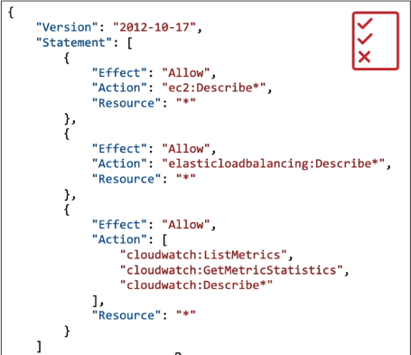
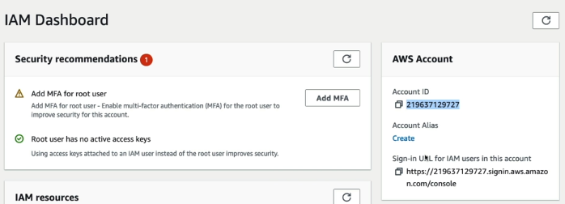
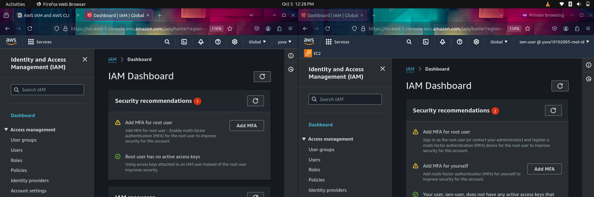
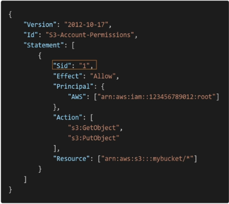

  

- IAM: Users and Groups
    
    - Identity and Access Management, Global service.
    - Users: People within the organization
    - Groups: Only contains Users, not other groups
    - Users don't have to belong to a group; they can belong to multiple groups.
- IAM Permissions
    
    - Users or groups can be assigned JSON documents called policies
    
    
    
    - these policies define the permissions of the users.
    - No need to give more permission than a user needs.
- Create an IAM User
    
    IAM Console ⇒ create users ⇒ Provide user details ⇒ click that I want to create an IAM user and provide password ⇒ Add user to group ⇒ create group ⇒ attach permission ⇒ add the user to group ⇒ create.
    
    Download the CSV file which contains login credentials.
    
    Customize the signed URL by creating an alias for it, in the AWS account section.
    
      
    
    
    
      
    
      
    
    > [!important] to use both accounts simultaneously, use private windows in the browser.
    > 
    > 
- IAM Policies Structure
    
    
    
      
    
    Consists of :
    
    - Version: policy language version, always include “2012-10-17”.
    - id: an identifier for the policy (Optional).
    - Statement: one or more individual statements (required).
    
      
    
    The statement consists of:
    
    - Sid: an identifier of the statement (optional).
    - Effect: whether the statement allows or denies access (ALLOW or DENY).
    - Principal: account/user/role to which this policy is applied to.
    - Action: list of actions this policy allows or denies.
    - Resource: list of resources to which the actions applied.
    - Condition: conditions for when this is in effect (optional).
- IAM MFA
    
    - AWS MFA (Multi-Factor Authentication) adds extra security to your account.
    - Requires two forms of authentication: password and a unique code from a device.
    - Devices can be:Virtual (e.g., Google Authenticator, Authy).
    - Hardware tokens  
        Enable MFA via IAM in the AWS console under user security credentials.  
        
    - Recommended for AWS root accounts and high-access IAM users.
- AWS CLI and Access Keys
    
    AWS CLI (Command Line Interface)  
    A tool to manage AWS services from the command line.  
    Allows you to control multiple AWS services using scripts or direct commands.  
    Useful for automating tasks like resource creation, management, and monitoring.  
      
    AWS Access Keys  
    Consists of an Access Key ID and a Secret Access Key.
    
    Required to authenticate requests made via AWS CLI or SDKs.
    
      
    Must be securely stored since they provide programmatic access to AWS resources.Can be generated and managed in the IAM section of the AWS console under Security credentials.  
      
    Using AWS CLI with Access Keys:  
    1. Install the AWS CLI.  
    
      
    2. Run aws configure to set up:  
    AWS Access Key ID  
    AWS Secret Access Key  
    Default region and output format  
      
    3. Safeguard access keys to prevent unauthorized access.  
      
    For better security, it's recommended to use IAM roles with temporary credentials when possible.  
    
      
    
- AWS CloudShell
    
    - AWS CloudShell: Browser-based shell for managing AWS resources.
    - Pre-installed tools: AWS CLI, git, Python, Node.js, etc.
    - 1GB persistent storage: Retains files between sessions.
    - Secure access: Integrated with your AWS account, no extra authentication.
    - Multi-region: Manage resources across multiple AWS regions.
    - Free to use: No extra cost for the shell, only for AWS resources used.
    
> [!important] Eg: Creating IAM User and Group Using AWS CLI in CloudShell

- Creating an IAM user: `aws iam create-user --user-name dev1`
- Creating an IAM group: `aws iam create-group --group-name developers`
- Attach a policy to the group:
 ```Bash
 aws iam attach-group-policy --group-name developers --policy-arn arn:aws:iam::aws:policy/AmazonEC2FullAccess
```

 ```Bash
 aws iam attach-group-policy --group-name developers --policy-arn arn:aws:iam::aws:policy/AmazonS3FullAccess
 ```

```Bash
 aws iam attach-group-policy --group-name developers --policy-arn arn:aws:iam::aws:policy/IAMFullAccess
```

```Bash
 aws iam attach-group-policy --group-name developers --policy-arn arn:aws:iam::aws:policy/AmazonVPCFullAccess
```

```Bash
 aws iam attach-group-policy --group-name developers --policy-arn arn:aws:iam::aws:policy/AmazonDynamoDBFullAccess
```

```Bash
 aws iam attach-group-policy --group-name developers --policy-arn arn:aws:iam::aws:policy/CloudWatchFullAccess
```
 - Attach the User to that group: `aws iam add-user-to-group --user-name dev1 --group-name developers`
 - To create a login profile for the IAM user dev1 with the password Gd9&GwgQ87K, use the following AWS CLI command:

 ```Bash
 aws iam create-login-profile --user-name dev1 --password Gd9@GwgQ87K
 ```

 This will enable console login for the user dev1 without requiring a password reset on the first login. Username: `dev1`
password: `Gd9@GwgQ87K`

- IAM Roles for Services

- Some AWS services will need to take action on your behalf.
- So, we will assign permission to AWS services with IAM roles.
- **Eg:** Creating an EC2 IAM role for IAM read-only access:

IAM ⇒ Roles ⇒ Create role ⇒ Select trusted entity [ AWS service ] ⇒ Select Usecase [ EC2 ] ⇒ Attach Permission policy [ IAMReadOnlyAccess ] ⇒ Role details and create.

- IAM Security Tools
- **IAM Credentials Report (account level):** a report [ .csv file ] that lists all your account’s users and the status of their various credentials.
- IAM Access Advisor (user-level): Access advisor shows the service permissions granted to a user and when those services were last accessed.