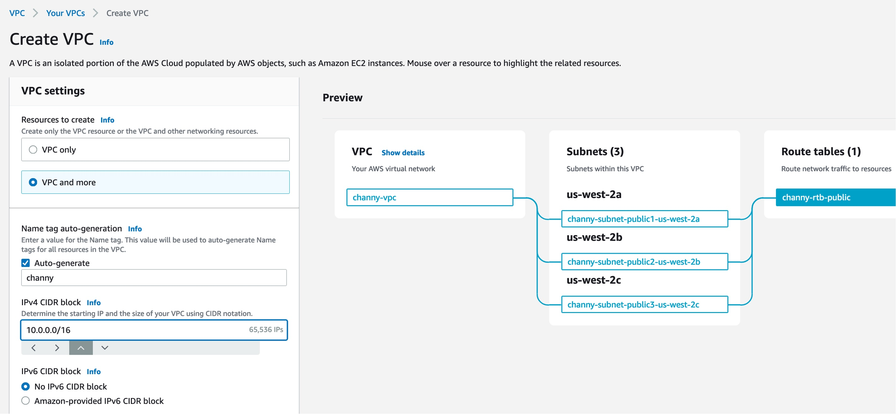

  

  

SUBSCRIBE to CloudChamp : [https://www.youtube.com/@cloudchamp](https://www.youtube.com/@cloudchamp)

> [!info] Cloud Champ  
> Hey there, I'm Nasiullha, a remote DevOps engineer, freelancer, and YouTuber at Cloudchamp.  
> [https://www.youtube.com/@cloudchamp](https://www.youtube.com/@cloudchamp)  

  

## **Explain the steps to set up a secured VPC with subnets and everything**

1. **Create VPC:**
    - Define VPC CIDR block and tenancy.
    - Enable DNS support and DNS hostnames if needed.
2. **Create Subnets:**
    - Allocate CIDR blocks for subnets.
    - Spread subnets across availability zones for redundancy.
3. **Configure Route Tables:**
    - Define routes for internet-bound traffic.
    - Associate subnets with route tables.
4. **Set Up NACLs:**
    - Configure inbound and outbound rules.
    - Associate NACLs with subnets.
5. **Implement Security Groups:**
    - Define inbound and outbound rules.
    - Associate security groups with instances.
6. **Add Internet Gateway (IGW):**
    - Attach IGW to VPC.
    - Update route tables for internet access.
7. **Optional - NAT Gateway/Instance:**
    - Set up in public subnet for private subnet internet access.
8. **Enable Monitoring:**
    - Enable VPC Flow Logs for traffic analysis.
    - Monitor with CloudWatch.

  



  

  

  

  

  

  

  

  

  

  

  

  

## Explain what this IAM policy does

```JSON
{
  "Version": "2012-10-17",
  "Statement": [
    {
      "Action": [
        "s3:ListBucket"
      ],
      "Effect": "Allow",
      "Resource": "arn:aws:s3:::company-data"
    },
    {
      "Action": [
        "ecs:RunTask"
      ],
      "Effect": "Allow",
     "Condition": {
        "ArnEquals": {
          "ecs:cluster": "arn:aws:ecs:us-east-1:123456789012:cluster/prod"
        }
      },
      "Resource": "arn:aws:ecs:us-east-1:123456789012:task-definition/update-tables:*"
    }
  ]
}
```

  

This AWS IAM policy grants permissions for two actions:

1. Allow listing objects in the S3 bucket named "company-data".
2. Allow running tasks in an ECS (Elastic Container Service) cluster named "prod" in the "us-east-1" region, specifically tasks defined by the task definition with the name prefix "update-tables".

  

  

  

  

  

  

## **How do you secure sensitive information such as API keys, passwords, and other credentials in a CI/CD pipeline on AWS?**

> To secure sensitive information in a CI/CD pipeline on AWS:
> 
> 1. **Use AWS Secrets Manager or Parameter Store:**
>     - Store secrets like API keys and passwords securely in AWS Secrets Manager or Parameter Store.
> 2. **Utilize IAM Roles for CI/CD:**
>     - Configure CI/CD processes to run with IAM roles that can access secrets from Secrets Manager or Parameter Store.
> 3. **Rotate Secrets Regularly:**
>     - Implement automated rotation of secrets to ensure timely updates and security.
> 4. **Encrypt Data:**
>     - Encrypt data in transit and at rest using HTTPS and encryption at rest features.
> 5. **Monitor and Audit Access:**
>     - Enable logging and monitoring to track access to secrets and detect any unauthorized access attempts.


  

  

  

  

  

## **Name some AWS services which are not region specific**

- AWS IAM, Amazon Route 53, and AWS CloudFront are some examples of AWS services that are not region-specific.  
      
      
      
    

  

  

  

  

## **Describe the key differences between Amazon EC2 and AWS Lambda. When would you choose one over the other for a specific task?**

- Amazon EC2 provides virtual servers that you manage, while AWS Lambda runs code in response to events and scales automatically.
- Choose EC2 for long-running tasks or when you need more control over the environment.
    - example: hosting a website with specific software requirements or running a database server.
- Choose Lambda for event-driven, short-lived tasks with automatic scaling.
    - example: processing event-driven actions such as file uploads, database updates, or API requests  
          
        


  

  

  

  

  

  

## **The CloudFormation template has an error that you have committed. What could happen as a result of the error, and how would you correct it?**

If there's an error in a CloudFormation template, it could lead to stack creation failure, misconfiguration of resources, or security vulnerabilities. To correct it:

1. **Identify the Error**: Check stack events or use the command `aws cloudformation describe-stack-events`.
2. **Debug and Update the Template**: Validate the template using `aws cloudformation validate-template` .
3. **Test the Template**: Optionally use Change Sets for previewing changes.
4. **Re-deploy the Stack**: Deploy the updated template with `aws cloudformation deploy`.

  

  

  

  

  

  

##   
  
  
  
  
**In VPC with private and public subnets, database servers should ideally be launched into which subnet?**

- Database servers should ideally be launched into private subnets
- This ensures enhanced security by restricting direct access from the internet and allows tighter control over network access using security measures like security groups and NACLs


  

  

  

  

  

  

  

  

  

  

  

## **How do you choose the right database service in AWS for a specific application’s requirements? Tell a little bit more about your experience.**

- **Amazon RDS** is ideal for applications that require a traditional relational database with standard SQL support, transactions, and complex queries.
- **Amazon [DynamoDB](https://www.datacamp.com/tutorial/single-table-database-design-with-dynamodb)** suits applications needing a highly scalable, NoSQL database with fast, predictable performance at any scale. It's great for flexible data models and rapid development.
- **Amazon Redshift** is best for analytical applications requiring complex queries over large datasets, offering fast query performance by using columnar storage and data warehousing technology.

  

  

  

  

  

  

  

## **Explain the concept of auto-scaling and how it can be implemented in AWS to handle fluctuating workloads.**

> Auto-scaling automatically adjusts the number of instances in a group based on demand. It can be implemented in AWS using services like Auto Scaling Groups, which dynamically adjust capacity to maintain performance and reduce costs.


  

  

  

  

  

  

  

## **Explain can you vertically scale an Amazon instance? How?**

> Vertical scaling involves increasing or decreasing the resources of an instance, such as CPU or RAM. This can be done manually by stopping the instance, changing its instance type to one with more or fewer resources, and then restarting it.


  

  

  

  

  

## **Can a connection be made between a company’s data center and the Amazon cloud? How?**

Yes, a connection can be established between a company's data center and the Amazon Web Services (AWS) cloud

1. **AWS Direct Connect**: A dedicated, high-bandwidth link for a private connection.
2. **Virtual Private Network (VPN)**: An encrypted connection over the internet for secure data transmission.

  

  

  

  

  

  

  

## **Explain different AWS services to manage cost**

These services collectively help organizations monitor, analyze, and optimize their AWS costs.

1. **AWS Cost Explorer:** Visualizes and analyzes AWS spending patterns with forecasting and budgeting features.
2. **AWS Budgets:** Allows setting custom spending thresholds and sends alerts when exceeded.
3. **AWS Trusted Advisor:** Provides actionable recommendations for optimizing AWS infrastructure across various aspects.
4. **AWS Cost and Usage Report (CUR):** Offers detailed usage and cost data for in-depth analysis and reporting.
5. **AWS Savings Plans:** Flexible pricing models for significant savings on committed usage.


  

  

  

  

  
  
  
  

## **What is the difference between NAT gateways and NAT instances. why do we use them?**

  

**NAT Gateway vs. NAT Instance:**

- **NAT Gateway:** Managed by AWS, high performance, and availability, no administration needed.
- **NAT Instance:** User-managed EC2 instance, requires manual scaling and administration, less scalable and available compared to NAT Gateway.

**Use Cases:**

- Both enable outbound internet access for resources in private subnets.
- Enhance security by avoiding direct exposure of internal resources to the internet.
- Facilitate compliance and address translation.
- Choice depends on factors like performance, scalability, and management preferences.

  


  

  

  

  

  

## **What are different ways to access AWS services?**

1. **AWS Management Console:**
    - Web-based interface for point-and-click management of AWS services.
2. **AWS Command Line Interface (CLI):**
    - Command-line tool for scripting and automation of AWS tasks.
3. **AWS Software Development Kits (SDKs):**
    - Libraries for integrating AWS services into custom applications.
4. **AWS CloudFormation:**
    - Infrastructure as Code (IaC) for defining and provisioning AWS resources.

  

  

  

  

  

## **What are different types of load balancers and when to use them?**  
  

1. **Application Load Balancer (ALB): Layer 7**
    - For HTTP/HTTPS traffic and modern web applications with multiple services or APIs.
2. **Network Load Balancer (NLB): Layer 4**
    - For TCP/UDP traffic, high throughput, and low latency requirements, such as gaming or real-time communication.
3. **Gateway Load Balancer (GWLB):**
    - Routes traffic to Virtual Private Network (VPN) or AWS Direct Connect (DX) connections for VPN and DX traffic distribution across multiple appliances.  
          
        

Choose ALB for web applications, NLB for high throughput, low latency needs, and GWLB for VPN and DX traffic distribution across appliances.  
  


  

  

  

  

  

  

  

## **How do you allow or restrict access to AWS services?**

- To allow or restrict access to AWS services:

1. **IAM (Identity and Access Management):**
    - Manage access by defining policies for users, groups, or roles.
2. **Resource Policies:**
    - Control access at the resource level for services like S3 and SQS.
3. **NACLs (Network Access Control Lists):**
    - Act as subnets' firewalls, defining rules for inbound and outbound traffic.
4. **Security Groups:**
    - Virtual firewalls at the instance level, controlling inbound and outbound traffic.
5. **SCPs (Service Control Policies):**
    - Control access across multiple accounts in AWS Organizations.
6. **VPC Endpoints:**
    - Privately connect to AWS services within a VPC, avoiding public IPs.

  

  

  

  

  

  

  

  

  

## **Describe the advantages and disadvantages of using AWS RDS (Relational Database Service) compared to managing your own database on EC2 instances.**

- Advantages of RDS include managed backups, automated patching, and scaling. Disadvantages include less control over the database environment compared to managing it directly on EC2 instances.  
      
      
    

  

  

  

  

  

  

  
  

## **What the relationship between an instance and AMI is?**

- An instance is a running virtual server while an AMI (Amazon Machine Image) is a template used to create instances. Instances are launched from AMIs.  
      
      
      
      
      
      
    

## **What are different instance launch types and when to use them?**

- Different launch types include On-Demand Instances, Reserved Instances, and Spot Instances. Use On-Demand for flexible usage, Reserved for predictable workloads, and Spot for cost optimization with flexible start and end times.  
      
      
      
      
      
    

  

  

  

  
  
  
  

## **Can you describe the process of setting up a continuous delivery pipeline in AWS using CodePipeline and CodeBuild?**

- The process involves configuring a pipeline in CodePipeline, defining stages (source, build, test, deploy), connecting to a source repository, configuring build settings, and integrating with other AWS services for testing and deployment.


  

  

  
  
  
  
  

## **Your application stores sensitive customer data in an AWS RDS database. How would you ensure the security and compliance of this data?**

- Ensure encryption at rest and in transit, implement access controls using IAM, regularly audit database activity, and comply with relevant regulations such as GDPR or HIPAA.


  

  
  
  
  
  
  

## **Your team is adopting Docker for containerization. How would you deploy and manage Docker containers on AWS?**

- Deploy Docker containers using Amazon Elastic Container Service (ECS) or Amazon Elastic Kubernetes Service (EKS). These services provide managed container orchestration, scaling, and integration with other AWS services.  
      
      
      
      
      
      
      
      
    

## **Your company wants to migrate its on-premises infrastructure to AWS for cost savings and scalability. Outline the steps you would take to plan and execute this migration.**

- Steps include assessing current infrastructure, selecting migration strategy (lift-and-shift, re-platforming, re-architecting), estimating costs, planning for data migration, testing, and executing the migration with minimal downtime.  
      
      
      
      
      
      
      
      
      
      
    

## **Describe how AWS Identity and Access Management (IAM) is used to manage permissions and access control in AWS environments.**

- IAM allows you to create and manage users, groups, and roles to control access to AWS resources. You can define policies that specify the permissions users have, ensuring least privilege access and enhancing security.

  

  
  
  
  

  

  
  
  
  
  
  

## **Describe how you would set up automated testing processes within your CI/CD pipeline on AWS.**

To set up automated testing in your AWS CI/CD pipeline:

1. **Choose Testing Tools**: Select testing frameworks like JUnit or Selenium for different test types.
2. **Write Tests**: Develop unit, integration, and end-to-end tests alongside your code.
3. **Version Control**: Keep testing code in the same repository using Git for version control.
4. **AWS CodePipeline**: Use AWS CodePipeline to automate build, test, and deployment stages.
5. **Integrate Testing Tools**: Configure AWS CodeBuild or Jenkins to execute tests during the pipeline.
6. **Artifact Storage**: Store test artifacts (reports, logs) in Amazon S3 for reference.
7. **Monitor with CloudWatch**: Use AWS CloudWatch to monitor test results and detect failures.
8. **Feedback Loop**: Set up notifications for developers on test failures for quick resolution.
9. **Continuous Improvement**: Regularly review and enhance testing processes for better coverage and reliability.

Implementing these steps ensures automated testing seamlessly integrates into your CI/CD pipeline on AWS.

  

  

  
  
  
  
  

  
  

## **Explain the process of rolling back a failed deployment in AWS.**

To roll back a failed deployment in AWS:

1. **Identify Failure**: Monitor the deployment process to pinpoint the failure.
2. **Stop Deployment**: Halt any ongoing deployment to prevent further changes.
3. **Investigate Cause**: Analyze logs and errors to understand the issue.
4. **Rollback Plan**: Create a plan to revert changes made during the failed deployment.
5. **Execute Rollback**: Implement the rollback plan to restore the previous state.
6. **Verify**: Ensure the rollback is successful and the system functions as expected.
7. **Communicate**: Keep stakeholders informed about the status and resolution.
8. **Learn and Improve**: Conduct a post-mortem analysis to learn from the failure and prevent future issues.

  

  

Also checkout -

DevOps Interview Questions & Answers: [https://youtu.be/GX6fOvaS0Xs](https://youtu.be/GX6fOvaS0Xs)

> [!info] DevOps Interview Questions and Answers for Freshers and Experienced in 2024  
> DevOps interviews questions and Answers | DevOps interview questions for fresher | DevOps interview questions for experienced  
> [https://youtu.be/GX6fOvaS0Xs](https://youtu.be/GX6fOvaS0Xs)  

  
DevSecOps Project on Kubernetes:  
[https://youtu.be/g8X5AoqCJHc](https://youtu.be/g8X5AoqCJHc)

> [!info] DevSecOps Pipeline Project: Deploy Netflix Clone on Kubernetes  
> DevSecOps Project | DevOps project on Kubernetes | Deploy Netflix on EKS using devsecops pipeline  
> [https://youtu.be/g8X5AoqCJHc](https://youtu.be/g8X5AoqCJHc)  

  
Python Microservices project for DevOps Resume:  
[https://youtu.be/jHlRqQzqB_Y](https://youtu.be/jHlRqQzqB_Y)

> [!info] DevOps Project: Video to Audio Python Microservices App on Kubernetes  
> Kubernetes Project for Practice | DevOps project for resume | AWS Project | Python Microservices video to audio converter app | Kubernetes Microservices Deployment  
> [https://youtu.be/jHlRqQzqB_Y](https://youtu.be/jHlRqQzqB_Y)  

  
  
How to create DevOps Resume:  
[https://youtu.be/vf7EIaHuwzU](https://youtu.be/vf7EIaHuwzU)

> [!info] My DevOps Resume | How to Build DevOps Resume in 2024  
> DevOps Resume 2024 | DevOps Resume for Freshers | DevOps resume template - In this video we will learn how to create DevOps resume properly for freshers and even also devops resume for 3 years' experience or 5 years' experience.  
> [https://youtu.be/vf7EIaHuwzU](https://youtu.be/vf7EIaHuwzU)