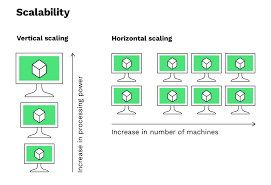

  

# Scalability

⇒ application/system can handle greater loads by adapting.

## Types of Scalability:

- Vertical Scalability
    - Increasing the size of the instances.
    - Eg: t2.micro =⇒ t2.large
    - common for non-distributed systems,database.
    - Eg: RDS,ElastiCache
    - limit for vertical scaling (Hardware limit).
- Horizontal Scalability
    - Increasing the number of instances.
    - implies in distributed systems.
    - Eg: Web application.
    - Eg: AWS EC2

---



# High Availability

⇒ Running your application in at least 2 data centers (Availability Zones ).

⇒ The goal is to survive a data center loss

  

⇒ it can be passive. [ RDS Multi AZ’s ]

⇒ it can be Active. [ horizontal scaling ]

  

## High Availability & Scalability For EC2

- Vertical Scaling: Increase instance size (= scale up / down)
    - From: t2.nano - 0.5G of RAM, 1 vCPU
    - To: u-12tb1.metal – 12.3TB of RAM, 448 vCPUs
- Horizontal Scaling: Increase the number of instances (= scale out / in)
    - Auto Scaling Group
    - Load Balancer
- High Availability: Run instances for the same application across multi-AZ
    - Auto Scaling Group multi-AZ
    - Load Balancer multi-AZ

  

---

## Load Balancing

Load Balances are servers that forward traffic to multiple servers (e.g., EC2 instances) downstream


  

### **Why use a load balancer?**

- Distributes traffic across multiple instances
- Provides a single access point (DNS)
- Handles instance failures seamlessly
- Performs regular health checks
- Manages SSL termination (HTTPS)
- Enforces session stickiness with cookies
- Ensures high availability across zones
- Separates public and private traffic

---

# 🧾 **AWS Auto Scaling Group (ASG) 

## 🔍 What is Auto Scaling?

**Auto Scaling Group (ASG)** is an AWS feature that automatically adjusts the number of Amazon EC2 instances in a group based on traffic demand, system health, and scaling policies.

- 📈 **Scale Out**: Add instances when load increases.
    
- 📉 **Scale In**: Remove instances when load decreases.
    
- 🔄 **High Availability**: Automatically replaces unhealthy instances.
    

---

## 📐 ASG Architecture Overview

```plaintext
                        +-----------------------------+
                        |      Amazon Route 53        |
                        +-------------+---------------+
                                      |
                            +---------▼---------+
                            | Application Load  |
                            |     Balancer      |
                            +---------+---------+
                                      |
                    +----------------+----------------+
                    |                |                |
              +-----▼-----+    +-----▼-----+    +-----▼-----+
              |  EC2-1    |    |  EC2-2    |    |  EC2-3    |
              +-----------+    +-----------+    +-----------+
                     ⬆ Auto Scaling Group ⬆
```

---

## 🔧 Prerequisites

- AWS Account
    
- IAM User with full EC2 and ASG permissions
    
- Key Pair (for SSH)
    
- Basic knowledge of EC2, Load Balancers, and CloudWatch
    

---

## 🛠️ Step-by-Step Tutorial

---

### 4.1 🧱 Create a Launch Template

1. **Go to EC2 → Launch Templates**
    
2. **Create launch template**:
    
    - Name: `asg-launch-template`
        
    - AMI: Amazon Linux 2 or your preferred image
        
    - Instance Type: `t2.micro`
        
    - Key Pair: Your existing key
        
    - Security Group: Allow port 22 and 80
        
    - User Data (optional):
        
        ```bash
        #!/bin/bash
        yum update -y
        yum install -y httpd
        echo "Welcome to ASG Instance $(hostname -f)" > /var/www/html/index.html
        systemctl enable httpd
        systemctl start httpd
        ```
        
3. **Create template**
    

---

### 4.2 🎯 Create a Target Group

1. Go to **EC2 → Target Groups**
    
2. **Create target group**:
    
    - Type: Instances
        
    - Protocol: HTTP, Port: 80
        
    - VPC: Default or custom
        
3. Register no targets yet (ASG will handle it).
    
4. Save the ARN for later.
    

---

### 4.3 🌐 Create an Application Load Balancer

1. Go to **EC2 → Load Balancers → Create Load Balancer → Application Load Balancer**
    
2. **Configuration**:
    
    - Name: `asg-alb`
        
    - Scheme: Internet-facing
        
    - Listener: HTTP (port 80)
        
    - Availability Zones: Select at least two subnets
        
3. **Target Group**: Choose the previously created one.
    
4. Create the ALB and note the DNS name.
    

---

### 4.4 ⚙️ Create Auto Scaling Group

1. Go to **EC2 → Auto Scaling Groups**
    
2. **Create Auto Scaling Group**
    
    - Launch template: Select the one you created
        
    - Name: `asg-webserver`
        
3. **Network**: Select your VPC and two public subnets
    
4. **Attach to Load Balancer**:
    
    - Choose Application Load Balancer
        
    - Select your target group
        
5. **Group size**:
    
    - Desired Capacity: 2
        
    - Min: 1
        
    - Max: 3
        
6. **Health Check**: Select ELB and EC2
    
7. **Tagging (optional)**:
    
    - Key: `Name` Value: `asg-instance`
        
8. **Create ASG**
    

---

### 4.5 📏 Attach Scaling Policies

Go to **Auto Scaling Group > Automatic Scaling**

#### ➕ Scale Out Policy (CPU > 50%)

- Policy Type: Target Tracking
    
- Metric: Average CPU utilization
    
- Target value: 50%
    

#### ➖ Scale In Policy (CPU < 20%)

- Automatically created by target tracking
    

---

### 4.6 🧪 Testing Auto Scaling

1. **View instances**: Should have 2 instances initially.
    
2. **Simulate load**:
    
    SSH into an instance and run:
    
    ```bash
    sudo yum install -y stress
    stress --cpu 2 --timeout 300
    ```
    
    Wait and observe scaling activity in the **Activity History**.
    
3. **Scale-in**: When CPU drops below threshold.
    

---

## 📚 Practical Scenarios

### ✅ Scenario 1: Scale Based on CPU Utilization

Use CloudWatch metrics to trigger scale in/out events.

### ✅ Scenario 2: Scheduled Scaling

Scale out at 9 AM, scale in at 6 PM.

```bash
Start time: 09:00, Desired Capacity: 3
End time: 18:00, Desired Capacity: 1
```

### ✅ Scenario 3: Scale Based on Custom Metric (Requests per target)

Use Application Load Balancer metrics like `RequestCountPerTarget`.

### ✅ Scenario 4: Scale on SQS Queue Depth (For Worker ASG)

Use custom CloudWatch metric to monitor SQS message count.

---

## 📊 Monitoring and Logging

- **CloudWatch Metrics**:
    
    - Group metrics: GroupDesiredCapacity, GroupInServiceInstances
        
    - Scaling activity: `AutoScalingGroupName`
        
- **Notifications**:
    
    - Configure SNS topic for instance launch/terminate events.
        
- **Elastic Load Balancer Logs**:
    
    - Enable access logs for ALB in S3.
        

---

## 📏 Best Practices

- ✅ Use multiple AZs for high availability.
    
- ✅ Use health checks from both EC2 and ELB.
    
- ✅ Set instance protection if using lifecycle hooks.
    
- ✅ Use CloudWatch alarms for proactive scaling.
    
- ✅ Tag your ASG for cost allocation.
    

---

## 🧹 Cleanup Resources

```bash
# In the AWS Console:
1. Delete Auto Scaling Group
2. Delete Launch Template
3. Delete Load Balancer and Target Group
4. Delete Security Group (if custom)
5. Delete Key Pair (optional)
```

---

## 🧾 Conclusion

Auto Scaling Groups are essential for:

- **Fault tolerance**
    
- **Cost optimization**
    
- **On-demand scalability**
    

With proper setup and monitoring, you can ensure high availability and resilience of your applications.

---

# 🔁 **AWS Elastic Load Balancing (ELB)

## 1️⃣ Overview of ELB

**Elastic Load Balancer (ELB)** automatically distributes incoming application or network traffic across multiple targets (EC2, Lambda, IPs) in one or more AZs. It ensures **fault tolerance** and **scalability**.

---

## 2️⃣ Types of Load Balancers

---

### 2.1 Application Load Balancer (ALB)

- OSI Layer: **Layer 7 (HTTP/HTTPS)**
    
- Features:
    
    - Path-based & host-based routing
        
    - WebSockets, HTTP/2 support
        
    - Sticky sessions (via cookies)
        
    - Integration with WAF
        

📘 **Use Case**: Web apps, microservices, API Gateway

---

### 2.2 Network Load Balancer (NLB)

- OSI Layer: **Layer 4 (TCP, UDP)**
    
- Features:
    
    - Extremely low latency
        
    - Supports static IP and Elastic IP
        
    - TLS termination (with certificates)
        
    - Preserves source IP
        

📘 **Use Case**: Real-time apps, gaming, low-latency systems

---

### 2.3 Gateway Load Balancer (GWLB)

- OSI Layer: **Layer 3**
    
- Features:
    
    - Routes traffic to third-party appliances (e.g., firewalls, packet inspection)
        
    - Combines transparent network gateway + load balancer
        
    - Requires Gateway Load Balancer endpoints (GWLBe)
        

📘 **Use Case**: Inline inspection (e.g., IDS/IPS, firewall appliances)

---

## 3️⃣ Sticky Sessions (Session Affinity)

Sticky Sessions ensure that a user's requests are routed to the **same backend instance**.

### 🔧 How to Enable (ALB):

1. Target Group → Attributes → **Stickiness**
    
2. Enable: ✅
    
3. Type: `lb_cookie`
    
4. Duration: 300–86400 seconds
    

### 🔧 How to Enable (NLB):

- Only available with **TLS listener**
    
- Session stickiness based on **source IP**
    

### ✅ Use Case:

- Shopping cart apps
    
- Stateful apps
    

---

## 4️⃣ SSL Certificates (HTTPS)

### 🔐 ALB SSL Termination

1. **Create/Import Certificate**:
    
    - Use **AWS Certificate Manager (ACM)**
        
    - Domain-validated certificate (e.g., `myapp.example.com`)
        
2. **Attach SSL Listener to ALB**:
    
    - Listener: `443` (HTTPS)
        
    - Forward to target group (port 80 or 443)
        
3. **Security Group**:
    
    - Allow inbound `443` to ALB
        
    - Allow traffic from ALB SG to EC2 (port 80/443)
        

### 🔐 NLB SSL (TLS Termination)

- Create a **TLS listener** on port `443`
    
- Attach certificate from ACM
    
- Forward to backend on port `443` or `80`
    

---

## 5️⃣ Connection Draining (Deregistration Delay)

### 🔄 What is it?

Allows in-flight requests to complete **before** terminating/deregistering instances.

### ⏱️ How to Enable:

- Go to **Target Group → Attributes**
    
- Set **Deregistration delay**: `0 to 3600` seconds (default: 300s)
    

### ✅ Use Case:

- Rolling deployments
    
- Instance replacement in Auto Scaling Group
    

---

## 6️⃣ Cross-Zone Load Balancing

Allows ELB to distribute incoming traffic **evenly across all registered targets in all AZs**.

### 🔄 ALB:

- **Always enabled** (cannot disable)
    

### 🔄 NLB:

- **Disabled by default**
    
- Go to **Load Balancer Attributes**
    
- Enable: ✅ Cross-Zone Load Balancing
    

### ✅ Benefit:

- Better load distribution
    
- Avoid AZ imbalance (especially with small target groups)
    

---

## 7️⃣ Monitoring & Logs

### 📊 Monitoring:

- Use **CloudWatch**:
    
    - `RequestCount`
        
    - `TargetResponseTime`
        
    - `HTTPCode_ELB_4XX/5XX`
        
    - `HealthyHostCount`
        

### 📁 Access Logs:

- Enable from **Load Balancer Attributes**
    
- Store logs in S3 Bucket
    
- Useful for:
    
    - Latency analysis
        
    - Security audits
        
    - Request tracing
        

---

## 8️⃣ Best Practices

✅ Use HTTPS everywhere (ACM + HTTPS listener)  
✅ Enable sticky sessions only when needed  
✅ Set appropriate deregistration delay (connection draining)  
✅ Use cross-zone LB to avoid AZ imbalance  
✅ Tag resources (environment, owner, etc.)  
✅ Enable access logs and CloudWatch alarms  
✅ Prefer ALB for microservices (host/path-based routing)  
✅ Use NLB for high performance or real-time traffic  
✅ Use GWLB for security appliances in traffic path

---

## 💡 Want Hands-On?

I can provide **step-by-step labs** for:

- Deploying ALB with 2-tier web app
    
- NLB with TLS termination
    
- Sticky sessions demo
    
- SSL certificate ACM setup
    
- Cross-zone benchmark
    
- Gateway Load Balancer with firewall appliance (3rd party AMI)
    

Let me know which lab you'd like, and I’ll generate the complete setup with Terraform or AWS Console steps.

---