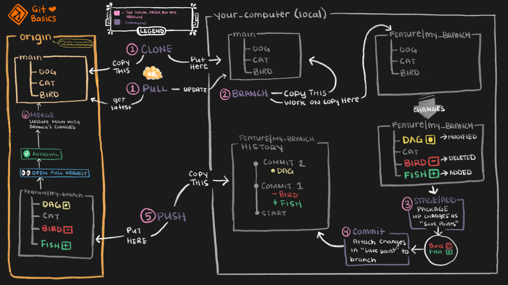

  

  

Git is a version control system used for tracking changes in code and collaboration.

### Key Concepts:

- **Repo**: Storage of project files and history.
- **Branch**: Independent line of development.
- **Commit**: A snapshot of changes.
- **Push/Pull**: Sync changes with a remote repository.
- **Merge**: Combine changes from branches.
- **Rebase**: Reapply commits for a linear history.
- **Stash**: Temporarily save uncommitted changes.

### Key Commands:

  

  

- `git init`: Create a new repo.
- `git add`: Stage changes.
- `git commit`: Save changes.
- `git push/pull`: Sync with a remote repo.
- `git merge`: Combine branches.

  

  

|                             |                                                                                  |                                            |
| --------------------------- | -------------------------------------------------------------------------------- | ------------------------------------------ |
| **Command**                 | **Description**                                                                  | **Example**                                |
| `git init`                  | Initializes a new Git repository.                                                | `git init`                                 |
| `git add`                   | Stages changes for the next commit.                                              | `git add <file>` or `git add .`            |
| `git status`                | Displays the current state of the working directory and staging area.            | `git status`                               |
| `git rm`                    | Removes files from the working directory and stages their deletion.              | `git rm <file>`                            |
| `git commit`                | Saves staged changes with a message.                                             | `git commit -m "Initial commit"`           |
| `git restore`               | Restores file changes to a previous state.                                       | `git restore <file>`                       |
| `git log`                   | Shows the commit history of the repository.                                      | `git log`                                  |
| `git reset`                 | Undoes commits, moves the branch to a previous state.                            | `git reset --hard <commit>`                |
| `git revert`                | Creates a new commit that undoes changes from a specific commit.                 | `git revert <commit>`                      |
| `git push`                  | Pushes local commits to the remote repository.                                   | `git push origin <branch>`                 |
| `git pull`                  | Fetches and merges changes from the remote repository.                           | `git pull origin <branch>`                 |
| `git remote -v`             | Displays the remote repositories linked to your local repo.                      | `git remote -v`                            |
| `git remote set-url origin` | Changes the URL of the `origin` remote repository.                               | `git remote set-url origin <new_url>`      |
| `git remote add origin`     | Adds a new remote repository (usually named `origin`).                           | `git remote add origin <url>`              |
| `git branch`                | Lists, creates, or deletes branches.                                             | `git branch <branch_name>`                 |
| `git checkout`              | Switches branches or restores files in the working directory.                    | `git checkout <branch>`                    |
| `git merge`                 | Merges changes from one branch into the current branch.                          | `git merge <branch_name>`                  |
| `git rebase`                | Reapplies commits on top of another base commit.                                 | `git rebase <branch_name>`                 |
| `git branch -d`             | Deletes a local branch.                                                          | `git branch -d <branch_name>`              |
| `git cherry-pick`           | Applies a commit from another branch to the current branch.                      | `git cherry-pick <commit>`                 |
| `git stash`                 | Temporarily stores changes in a stack to work on something else.                 | `git stash` / `git stash apply`            |
| `git squash`                | Combines multiple commits into one (usually during a rebase).                    | `git rebase -i <commit>` (squash option)   |
| `git conflicts`             | Occurs when Git cannot automatically merge changes, requiring manual resolution. | Resolve conflicts in files, then `git add` |