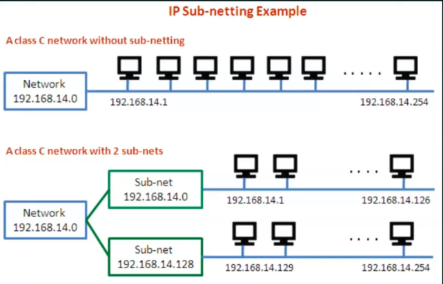
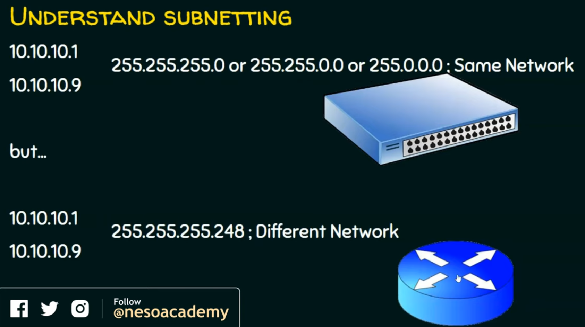
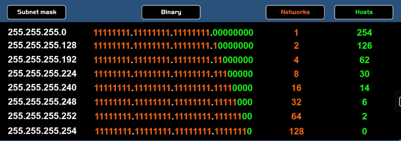
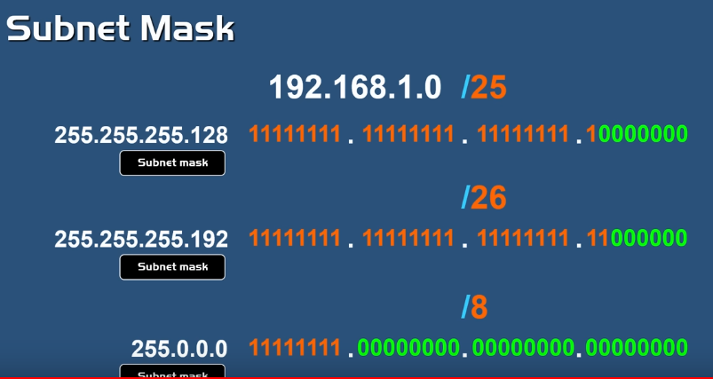
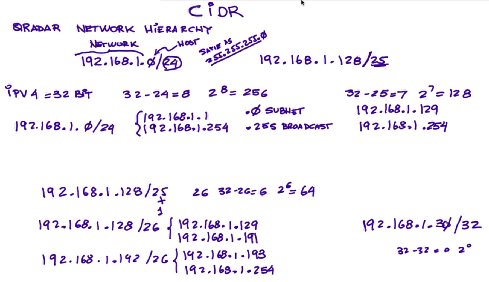
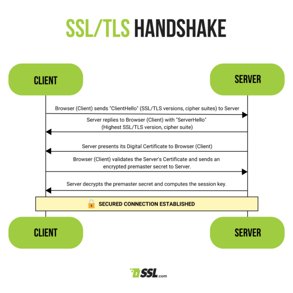
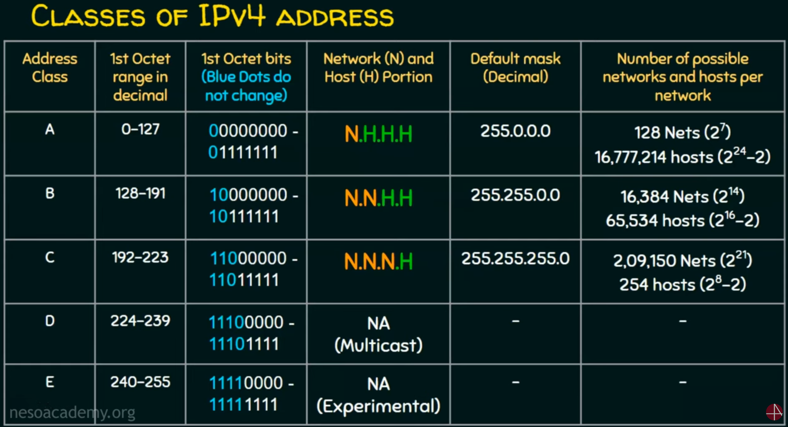

  

- **Subnets**
    
    - **Subnetting**
        
        logical subdivision of an IP network ⇒ subnet.
        
        deciding a network into two or more networks ⇒ Subnetting.
        
          
        
        Difference between without subnet and With Subnet.
        
        
        
        Without a subnet: every host belongs to a single network.
        
        With Subnet: The first subnet host can’t communicate with the second subnet host.
        
          
        
        Based on with and without default Subnet mask
        
        
        
          
        
        1. first two IP addresses belong to the same subnet.
        2. if `255.255.255.0` means where the IP address starts with `10.10.10.xx` will belong to the same network.
        3. if `255.255.0.0` means where the IP address starts with `10.10.xx.xx` will belong to the same network.
        4. if `255.0.0.0` means where the IP address starts with `10.xx.xx.xx` will belong to the same network.
        5. The Switch is enough to establish this network.
        
          
        
        1. it requires a router to communicate between these two IP addresses.
        2. these two addresses don’t belong to the same subnet.
        3. Because the `255.255.255.``248` subnet mask is different, it has a subdivision of subnetworks.
    - **5 - steps for subnetting**
        
        
        
        1. Identify [ Class of the IP , Default Subnet mask ].
        2. Convert [ Default Subnet mask ⇒ Binary ].
        3. Note [ Number of Hosts required ] , Find [ Subnet Generator, octet position ].
        4. Generate [ New subnet mask ].
        5. Use the Subnet Generator ⇒ generate the network range (subnet) in appropriate octet position.
    - **CIDR Notation**
        
        CIDR ⇒ Classless Inter-Domain Routing
        
        method of IP address allocation and IP routing that allows for more efficient use of IP addresses.
        
          
        
        **Representation:** `a . b . c . d / n`
        
        **Example:** `20.10.50.100/20`
        
          
        
        
        
        you could express `192.168. 1.0` with a `22-bit` network identifier as `192.168. 1.0/22`.
        
          
        
        - Class A supported 16,777,214 hosts
        - Class B supported 65,534 hosts
        - Class C supported 254 hosts.
        
        
        
          
        
        CIDR block range from `/8 to /32`
        
        - Class A: /8 to /32
        - Class B: /16 to /32
        - Class C: /24 to /32
        
          
        
        - **normal CIDR Problem**
            
            ### CIDR Notation Example: `192.168.1.0/24`
            
            1. **IP Address**: `192.168.1.0`
            2. **Prefix Length**: `/24` (This means the first 24 bits are used for the network, and the remaining 8 bits are for hosts.)
            
            ### Step-by-Step Breakdown:
            
            1. **Convert the Prefix Length**:
                
                `/24` means the first 24 bits represent the network, and the last 8 bits represent hosts. In binary, it looks like this:
                
                ```Plain
                11111111.11111111.11111111.00000000
                ```
                
                The first 24 bits are fixed for the network, and the last 8 bits are available for devices.
                
            2. **Subnet Mask**:
                
                A `/24` prefix length converts to the subnet mask:
                
                ```Plain
                255.255.255.0
                ```
                
                The first 24 bits are `1`s (255 in decimal), and the remaining 8 bits are `0`s (0 in decimal).
                
            3. **Number of IP Addresses**:
                
                In a `/24` subnet, 8 bits are available for hosts. The number of possible IP addresses is:
                
                ```Plain
                2^8 = 256 IP addresses
                ```
                
                However, 2 addresses are reserved:
                
                - **Network address**: First address (all `0`s in the host portion), `192.168.1.0`
                - **Broadcast address**: Last address (all `1`s in the host portion), `192.168.1.255`
                
                So, the number of usable IP addresses is:
                
                ```Plain
                256 - 2 = 254 usable IP addresses (192.168.1.1 to 192.168.1.254)
                ```
                
            
            ### Formula for Available Hosts:
            
            For a prefix length `/n`, the number of usable IP addresses is:
            
            ```Plain
            2^(32 - n) - 2
            ```
            
            The `-2` accounts for the network and broadcast addresses.
            
            ### More Examples:
            
            1. **CIDR Notation:** `**192.168.0.0/16**`
                - Subnet mask: `255.255.0.0`
                - Usable IP addresses: `65,534`
            2. **CIDR Notation:** `**10.0.0.0/8**`
                - Subnet mask: `255.0.0.0`
                - Usable IP addresses: `16,777,214`
            3. **CIDR Notation:** `**192.168.1.0/28**`
                - Subnet mask: `255.255.255.240`
                - Usable IP addresses: `14`
        
- **Ports**
    
    Ports are communication endpoints that direct network traffic to the correct application or service on a device.
    
      
    1. Port Numbers:
    
    - Well-known Ports (0–1023):  
        These are reserved for system or well-known services like HTTP (Port 80) or SSH (Port 22).  
        
    - Registered Ports (1024–49151): These are assigned by the IANA for user processes or applications, e.g., MySQL uses port 3306.
    - Dynamic/Private Ports (49152–65535): These are used for client-side communications and are often dynamically assigned.
    
      
      
    2. Common Ports and Their Uses:
    
    |   |   |
    |---|---|
    |HTTP (80)|Unencrypted web traffic|
    |HTTPS (443)|Secure web traffic|
    |FTP (21)|File Transfer Protocol, for transferring files|
    |SSH (22)|Secure Shell, for secure remote access|
    |SMTP (25)|Simple Mail Transfer Protocol, for sending emails|
    |DNS (53)|Domain Name System, for resolving domain names|
    |Telnet (23)|Unencrypted remote communication (less used due to insecurity).|
    |RDP (3389)|Remote Desktop Protocol, for Windows remote connections.|
    
      
    3. How Ports Work:  
    When data is sent over the network, it is associated with a port number.  
    Each device on a network has a unique IP address.Ports ensure that the data reaches the appropriate service or application on a device.  
    
    For example, web servers listen on port 80 or 443 for incoming HTTP/HTTPS requests.  
      
    4. Types of Ports:  
    TCP Ports: Used by Transmission Control Protocol, which ensures reliable, ordered, and error-checked delivery (e.g., SSH, HTTP).
    
      
    UDP Ports: Used by User Datagram Protocol, which is faster but less reliable (e.g., DNS, VoIP).  
      
    5. Port Scanning:  
    A technique used to identify open ports on a network. This can be a security vulnerability if ports that shouldn’t be exposed are open.  
      
    6. Port Forwarding:  
    A method used to allow external devices to access services on a private network.  
    
    For example, forwarding port 8080 from the router to a web server inside the network.  
      
      
    7. Firewall and Ports:  
    A firewall is a security device or software that monitors and controls incoming and outgoing network traffic based on predefined security rules.  
    
    Firewalls use ports to filter traffic and determine which applications or services are allowed to communicate over the network.
    
      
    Port Filtering/Blocking: Firewalls can allow or block specific ports.
    
    For example, blocking port 22 can prevent remote access via SSH.
    
      
    Open and Closed Ports: A firewall can be configured to keep certain ports "open" (allowing communication) or "closed" (blocking communication).  
      
    8. Port Binding:  
    Port binding refers to the process of associating a specific application or service with a particular port number on a machine. This ensures that data intended for a specific service is directed to the correct application.  
    
      
    Example: A web server like Apache or Nginx binds to port 80 (HTTP) or 443 (HTTPS). When a request comes in, the web server accepts it because it is "listening" on those ports.  
      
    
      
    9. Monitoring Ports:  
    Monitoring ports is crucial for maintaining network security and performance. This process involves checking which ports are open, what traffic is flowing through them, and whether any suspicious activity is occurring.  
    Tools for Port Monitoring:  
    Netstat (command-line utility): Shows active connections and open ports.  
    Nmap: A network scanning tool that can detect open ports and services running on a network.
    
      
      
    10. Troubleshooting Ports:  
    When network issues arise, ports are often a key point of investigation. Common issues include blocked ports, misconfigured port forwarding, or ports not listening.  
    
      
    Steps to Troubleshoot Ports:  
    1. Check Port Status: Use commands like `netstat`, `ss`, or `nmap` to see if the port is open and listening.  
      
    2. Test Connectivity: Use tools like telnet or nc (`netcat`) to verify if a port is reachable.  
      
    3. Check Firewall Rules: Ensure the firewall isn’t blocking the necessary ports.  
      
    4. Port Forwarding: Check if port forwarding rules are correctly configured in routers for external access.  
    
- **Routing and Switching**
    
    ### Routing and Switching
    
    ---
    
    ### **Routing**
    
    - **Purpose**: Routing is the process of forwarding data packets from one network to another. It enables communication between different networks or subnets.
    - **Key Components**:
        - **Router**: A networking device that forwards data packets between computer networks.
        - **Routing Table**: A data table stored in a router that lists the routes to particular network destinations.
        - **Routing Protocols**: Define how routers communicate and exchange routing information.
            - **Types of Routing Protocols**:
                - **Static Routing**: Manually defined routes.
                - **Dynamic Routing**: Routes are automatically adjusted by protocols like:
                    
                    ---
                    
                    ### **1. OSPF (Open Shortest Path First)**
                    
                    - **Type**: Link-state protocol (internal routing).
                    - **Use Case**: Medium to large networks.
                    - **Key Features**:
                        - Fast route updates using topology information.
                        - Divides networks into areas for scalability.
                        - Uses cost-based metrics (typically bandwidth).
                    - **Pros**: Fast convergence, scalable, vendor-neutral.
                    - **Cons**: Complex to set up and manage.
                    
                    ---
                    
                    ### **2. BGP (Border Gateway Protocol)**
                    
                    - **Type**: Path-vector protocol (external routing).
                    - **Use Case**: Routing between different networks (e.g., the internet).
                    - **Key Features**:
                        - Routes between autonomous systems.
                        - Policy-based routing (customizable by admins).
                    - **Pros**: Highly scalable, powers global internet routing.
                    - **Cons**: Slower convergence, complex configuration.
                    
                    ---
                    
                    ### **3. EIGRP (Enhanced Interior Gateway Routing Protocol)**
                    
                    - **Type**: Advanced distance-vector protocol (internal routing).
                    - **Use Case**: Cisco environments (enterprise networks).
                    - **Key Features**:
                        - Fast updates with efficient use of resources.
                        - Uses multiple metrics (bandwidth, delay, etc.).
                    - **Pros**: Fast, easy to configure, low resource usage.
                    - **Cons**: Cisco proprietary, limited in non-Cisco networks.
                    
                    ---
                    
                    **Summary**:
                    
                    - **OSPF**: Great for scalable internal networks.
                    - **BGP**: Essential for internet or external network routing.
                    - **EIGRP**: Ideal for Cisco-based, fast internal networks.
    
      
    
      
    
    - **Key Terms**:
        - **Default Gateway**: The router that network traffic goes through when a device is sending data outside its local network.
        - **CIDR (Classless Inter-Domain Routing)**: Used for IP addressing and subnetting.
        - **NAT (Network Address Translation)**: Translates private IP addresses to a public IP address to facilitate internet communication.
    
    ---
    
    ### **Switching**
    
    - **Purpose**: Switching involves forwarding data packets within the same network. It primarily operates at Layer 2 (Data Link layer) of the OSI model.
    - **Key Components**:
        - **Switch**: A networking device that connects devices within a network and uses MAC addresses to forward data to the correct destination.
        - **Switching Techniques**:
            - **Layer 2 Switching**: Works based on MAC addresses (used for internal network traffic).
            - **Layer 3 Switching**: Works similarly to a router but can handle IP addresses for both internal and external network traffic.
    - **Key Terms**:
        - **VLAN (Virtual Local Area Network)**: A logical subdivision of a network that allows devices to be grouped together, even if they are not physically connected to the same switch.
        - **STP (Spanning Tree Protocol)**: Prevents loops in network topology.
        - **MAC Address Table**: A table that stores MAC addresses to determine where to send the data within a local network.
    
    ---
    
- **Network Attached Translation (NAT)**
    
    ### Network Address Translation (NAT)
    
    **Purpose**: NAT allows multiple devices on a private network to share a single public IP address for internet access, helping conserve global IP address space.
    
    ---
    
    ### **Key Types of NAT**:
    
    1. **Static NAT**: Maps one private IP address to one public IP address.
        - **Use Case**: Servers requiring constant access from the internet.
    2. **Dynamic NAT**: Maps a pool of private IP addresses to a pool of public IP addresses.
        - **Use Case**: Temporary connections for internal devices to access the internet.
    3. **PAT (Port Address Translation)**, or **NAT Overload**: Multiple private IP addresses are mapped to a single public IP address by using different ports.
        - **Use Case**: Common in home networks or small businesses to allow many devices to share one public IP.
    
    ---
    
    ### **Benefits**:
    
    - **IP Conservation**: Reduces the need for multiple public IPs.
    - **Security**: Hides internal IP addresses from external networks.
    
    ---
    
    ### **Drawbacks**:
    
    - **Breaks End-to-End Communication**: Can interfere with some applications like VoIP or online gaming unless properly configured.
- **Firewalls and Security Groups**
    
    ### Firewalls and Security Groups
    
    Both firewalls and security groups are used to control network traffic, but they serve different purposes and are used in different contexts.
    
    ---
    
    ### **Firewalls**
    
    - **Purpose**: Protect networks by filtering incoming and outgoing traffic based on predefined security rules.
    - **Types**:
        1. **Network Firewalls**: Operate at the network level, controlling traffic between different networks or subnets.
        2. **Host-Based Firewalls**: Installed on individual devices, controlling traffic to and from that device.
    - **How They Work**: Use rules based on IP addresses, ports, and protocols to allow or block traffic.
    - **Use Case**: Commonly used in on-premise data centers or as part of a cloud environment's perimeter security.
    
      
    
    |   |   |   |
    |---|---|---|
    |**Feature**|**Stateful**|**Stateless**|
    |**Definition**|Tracks the state of active connections|Treats each request independently|
    |**Connection Awareness**|Yes, remembers past requests|No, evaluates packets individually|
    |**Example**|Stateful firewall allowing return traffic|Stateless firewall checking each packet|
    |**Pros**|More secure, and efficient for ongoing connections|Faster, uses less memory|
    |**Cons**|Requires more resources|Less secure, needs specific rules for traffic|
    |**Use Case**|Complex networks requiring detailed tracking|Simple, low-resource environments|
    
    ---
    
    ### **Security Groups**
    
    - **Purpose**: Act as virtual firewalls for cloud resources, controlling traffic at the instance level (e.g., AWS EC2, Azure VMs).
    - **How They Work**:
        - Set rules to allow inbound and outbound traffic based on IPs, protocols, and ports.
        - Only allow rules (no deny rules), meaning any unspecified traffic is automatically blocked.
    - **Use Case**: Used in cloud environments to secure specific instances or services.
    
    ---
    
    ### **Key Differences**:
    
    |   |   |   |
    |---|---|---|
    |Feature|**Firewalls**|**Security Groups**|
    |**Location**|Network or host level|Instance/service level (cloud)|
    |**Rules**|Allow and deny traffic|Allow-only rules|
    |**Use Case**|On-premise or cloud perimeters|Cloud resource security|
    
    **Summary**: Firewalls provide broader network protection, while security groups are more granular and instance-specific, mainly used in cloud environments.
    
- **Ingress and Egress Traffic**
    
      
    
    |   |   |   |
    |---|---|---|
    |Feature|**Ingress Traffic**|**Egress Traffic**|
    |**Definition**|Data traffic entering a network or system|Data traffic exiting a network or system|
    |**Direction**|Incoming|Outgoing|
    |**Use Case**|Incoming requests to a web server|Responses from a web server to clients|
    |**Monitoring**|Often monitored for security threats|Often monitored for data usage or compliance|
    |**Common Protocols**|HTTP, HTTPS, FTP, etc.|HTTP, HTTPS, FTP, etc.|
    |**Security Focus**|Firewalls often filter ingress traffic to block unauthorized access|Firewalls and rules ensure sensitive data isn’t leaked|
    |**Impact on Resources**|Can affect server load and performance|Can impact bandwidth usage|
    
    ### Summary:
    
    - **Ingress**: Traffic coming into a network, often monitored for security.
    - **Egress**: Traffic leaving a network, monitored for compliance and data usage.
- **Virtual Private Networks (VPN)**
    
    ### Virtual Private Networks (VPN)
    
    VPNs create secure connections over the internet, allowing users to access private networks remotely or connect multiple networks securely.
    
    ---
    
    ### **1. Site-to-Site VPN**
    
    - **Definition**: Connects entire networks (e.g., two offices) over the internet, creating a secure link between them.
    - **How It Works**:
        - Establishes a dedicated tunnel between two VPN gateways (e.g., routers or firewalls).
        - Encrypts traffic between sites, making it secure.
    - **Advantages**:
        - Securely connects multiple office locations.
        - Simplifies network management by treating remote sites as part of the local network.
    - **Use Cases**:
        - Corporations with multiple offices needing secure communication between them.
        - Connecting branch offices to a central headquarters.
    
    ---
    
    ### **2. Remote Access VPN**
    
    - **Definition**: Allows individual users to connect to a private network from a remote location over the internet.
    - **How It Works**:
        - Users install VPN client software on their devices (laptops, smartphones).
        - Establishes a secure connection to the VPN server, encrypting the user's internet traffic.
    - **Advantages**:
        - Provides secure access for remote workers to company resources.
        - Protects users' data and privacy on public networks (e.g., Wi-Fi).
    - **Use Cases**:
        - Employees accessing corporate networks from home or while traveling.
        - Individuals wanting to secure their internet connection and maintain privacy.
    
    ---
    
    ### Summary Table
    
    |   |   |   |
    |---|---|---|
    |Feature|**Site-to-Site VPN**|**Remote Access VPN**|
    |**Connection Type**|Connects entire networks|Connects individual users|
    |**How It Works**|Creates a secure tunnel between gateways|Establishes a secure connection to a VPN server|
    |**Advantages**|Secure communication between offices|Secure access for remote users|
    |**Use Cases**|Multi-office corporations|Remote workers and individual users|
    |**Typical Users**|Organizations|Employees and individuals|
    
- **SSL/TLS**
    
    ### SSL/TLS
    
    SSL (Secure Sockets Layer) and TLS (Transport Layer Security) are cryptographic protocols designed to provide secure communication over a computer network, primarily used for web traffic.
    
    
    
    ---
    
    ### **1. HTTPS Encryption**
    
    - **Definition**: HTTPS (Hypertext Transfer Protocol Secure) is the secure version of HTTP, using SSL/TLS to encrypt data transmitted between a web browser and a server.
    - **How It Works**:
        - Establishes a secure connection using SSL/TLS protocols.
        - Encrypts data in transit, protecting it from eavesdropping and tampering.
    - **Advantages**:
        - Ensures data confidentiality, integrity, and authenticity.
        - Builds user trust by indicating a secure connection (e.g., padlock icon in browsers).
    - **Use Cases**:
        - Securing online transactions (e.g., e-commerce sites).
        - Protecting sensitive information (e.g., login credentials, personal data) exchanged between users and websites.
    
    ---
    
    ### **2. SSL Certificate Management**
    
    - **Definition**: The process of obtaining, installing, and maintaining SSL/TLS certificates, which are used to establish secure connections.
    - **How It Works**:
        - Certificates are issued by Certificate Authorities (CAs) to verify the identity of the organization.
        - The certificate includes the public key, which is used to establish the secure connection.
    - **Key Steps in Management**:
        - **Obtaining Certificates**: Requesting and purchasing certificates from trusted CAs.
        - **Installation**: Configuring the web server to use the certificate for secure connections.
        - **Renewal**: Regularly renewing certificates before they expire to maintain security.
        - **Revocation**: Revoking certificates that are compromised or no longer needed.
    - **Advantages**:
        - Ensures secure communication for users and organizations.
        - Helps maintain compliance with security standards and regulations.
    - **Use Cases**:
        - Managing certificates for websites, email servers, and applications requiring secure connections.
        - Implementing certificate transparency and monitoring for potential vulnerabilities.
    
    ---
    
    ### Summary Table
    
    |   |   |   |
    |---|---|---|
    |Feature|**HTTPS Encryption**|**SSL Certificate Management**|
    |**Definition**|Secure version of HTTP|Process of obtaining and maintaining SSL certificates|
    |**How It Works**|Encrypts data in transit using SSL/TLS|Issues and configures certificates for secure connections|
    |**Advantages**|Ensures confidentiality and integrity|Establishes trust and compliance|
    |**Use Cases**|Securing online transactions|Managing certificates for websites and applications|
    |**Key Elements**|Data encryption and authentication|Obtaining, installing, renewing, and revoking certificates|
    
- **DNS**
    
    ### Domain Name System (DNS)
    
    DNS is a hierarchical and decentralized naming system used to translate human-readable domain names (like [www.example.com](http://www.example.com/)) into IP addresses (like 192.0.2.1) that computers use to identify each other on the network.
    
    ---
    
    ### **Key Components of DNS**
    
    1. **Domain Names**: Structured in a hierarchy, typically consisting of several levels separated by dots (e.g., `www.example.com`).
    2. **DNS Records**: Data entries in the DNS database that provide information about a domain. Common types include:
        - **A Record**: Maps a domain to an IPv4 address.
        - **AAAA Record**: Maps a domain to an IPv6 address.
        - **CNAME Record**: Canonical Name record that aliases one domain to another.
        - **MX Record**: Mail Exchange record that specifies mail servers for a domain.
        - **TXT Record**: Text record used for various purposes, including verification and security.
    
      
    
      
    
    1. **DNS Servers**:
    
    
    
    - **Recursive Resolver**: The server that receives DNS queries from clients, performs the necessary lookups, and returns the results.
    - **Root Name Server**: The top-level DNS server that directs queries to the appropriate top-level domain (TLD) servers.
    - **TLD Name Server**: Responsible for the top-level domains (e.g., .com, .org) and directs queries to the authoritative name servers for specific domains.
    - **Authoritative Name Server**: Holds the DNS records for a specific domain and responds to queries with the corresponding IP address.
    
    ---
    
    ### **How DNS Works**
    
    1. **User Input**: A user enters a domain name into a web browser.
    2. **Query Sent**: The browser sends a DNS query to the recursive resolver.
    3. **Cache Check**: The resolver checks its cache for a previously stored IP address for that domain.
    4. **Querying the DNS Hierarchy**:
        - If not found, the resolver queries the root name server.
        - The root server points to the appropriate TLD server.
        - The TLD server points to the authoritative name server for the domain.
    5. **Response**: The authoritative server responds with the corresponding IP address.
    6. **Accessing the Site**: The resolver caches the response and returns the IP address to the browser, which then accesses the website.
    
    ---
    
    ### **Benefits of DNS**
    
    - **Human-Friendly**: Allows users to access websites using easy-to-remember names instead of numeric IP addresses.
    - **Decentralized Management**: Distributes the management of domain names and their corresponding IP addresses across multiple servers.
    - **Caching**: Reduces latency and load on DNS servers by storing frequently accessed DNS records.
    
    ---
    
    ### **Security Considerations**
    
    - **DNS Spoofing/Cache Poisoning**: An attack where corrupt DNS data is introduced into a resolver's cache.
    - **DNSSEC (DNS Security Extensions)**: Adds a layer of security by allowing DNS responses to be verified for authenticity.
    
    ---
    
    ### Summary Table
    
    |   |   |
    |---|---|
    |Feature|**Description**|
    |**Purpose**|Translates domain names into IP addresses|
    |**Domain Structure**|Hierarchical, with levels separated by dots|
    |**Key Records**|A, AAAA, CNAME, MX, TXT|
    |**Main Servers**|Recursive resolvers, root servers, TLD servers, authoritative servers|
    |**Benefits**|Human-friendly, decentralized, caching|
    |**Security Concerns**|Spoofing, cache poisoning, mitigated by DNSSEC|
    
- **Load Balancing**
    - Definition :
        
        A load balancer distributes incoming traffic across multiple servers to prevent overloading, improve performance, and ensure high availability. It checks server health and reroutes traffic if one fails.  
          
        
    - Types:
        - Layer 4: Balances based on IPs and TCP/UDP connections.
        - Layer 7: Balances using application data like HTTPs headers.
    - Difference and examples :
        
        ### 1. Application Load Balancer (ALB)
        
        ### **Overview**:
        
        - Operates at the **Application Layer (Layer 7)** of the OSI model.
        - ALB distributes traffic based on content, such as HTTP headers, request paths, or query strings.
        
        ### **Workflow**:
        
        1. **Client** sends an HTTP/HTTPS request.
        2. **ALB** inspects the request (e.g., host, path, headers) and routes it to the appropriate target (EC2 instances, containers, or Lambda functions).
        3. The **Target Group** processes the request, and a response is sent back to the client via ALB.
        
        ### **Example**:
        
        - A web application with different subdomains, e.g., `blog.example.com` and `shop.example.com`. ALB routes traffic based on the subdomain to different microservices.
        
        ---
        
        ### 2. Network Load Balancer (NLB)
        
        ### **Overview**:
        
        - Operates at the **Network Layer (Layer 4)** of the OSI model.
        - NLB routes traffic based on IP protocol data (e.g., TCP, UDP).
        
        ### **Workflow**:
        
        1. **Client** sends a request over TCP/UDP.
        2. **NLB** forwards the request based on IP and port information to the appropriate target.
        3. The **Target** handles the request, and the response is sent back through NLB.
        
        ### **Example**:
        
        - A real-time gaming server needing low latency and handling millions of requests, such as multiplayer games or financial trading systems.
        
        ---
        
        ### 3. Gateway Load Balancer (GWLB)
        
        ### **Overview**:
        
        - Operates at the **Network Layer (Layer 3)** but is designed for **transparent** traffic inspection and forwarding.
        - Integrates third-party services such as firewalls, intrusion detection systems, or packet filtering.
        
        ### **Workflow**:
        
        1. **Client** sends traffic that is intercepted by GWLB.
        2. **GWLB** forwards traffic to **target appliances** (e.g., firewalls or security appliances).
        3. After inspection, the traffic is forwarded to its intended destination.
        
        ### **Example**:
        
        - Using a GWLB to route traffic through a third-party **Intrusion Detection System (IDS)** before allowing traffic into a virtual private cloud (VPC).
        
        ---
        
        ### 4. API Gateway
        
        ### **Overview**:
        
        - Works at **Layer 7**, but unlike ALB, it is designed for handling and managing APIs.
        - Provides features like **rate limiting**, **authentication**, **caching**, and **logging** for APIs.
        
        ### **Workflow**:
        
        1. **Client** sends an API request (typically RESTful, WebSocket, or GraphQL).
        2. **API Gateway** manages and processes the request, applying any policies (e.g., authentication, throttling).
        3. **API Gateway** forwards the request to the appropriate backend service (microservice, Lambda, or serverless function).
        4. The backend service processes the request, and the response is returned to the client through the API Gateway.
        
        ### **Example**:
        
        - A **mobile app** communicating with a backend server using a REST API managed by an API Gateway. It enforces authentication via OAuth and limits API calls to prevent misuse.
        
        ---
        
        ### Summary Table
        
        |   |   |   |   |   |
        |---|---|---|---|---|
        |Feature|Application Load Balancer (ALB)|Network Load Balancer (NLB)|Gateway Load Balancer (GWLB)|API Gateway|
        |**OSI Layer**|Layer 7 (Application)|Layer 4 (Network/Transport)|Layer 3/4 (Network)|Layer 7 (Application)|
        |**Routing Criteria**|HTTP headers, path, and content-based routing|IP address, TCP/UDP|Transparent traffic forwarding|API requests (REST, WebSocket, etc.)|
        |**Ideal Use Case**|Web applications, microservices, content-based apps|Low latency, high throughput apps, real-time apps|Traffic inspection with security appliances|Managing and securing APIs|
        |**Protocols Supported**|HTTP, HTTPS, WebSocket|TCP, UDP, TLS|Any IP-based traffic|REST, WebSocket, GraphQL|
        |**Target Types**|EC2 instances, containers, Lambda functions|EC2 instances, IP addresses|Third-party appliances (firewalls, IDS)|Lambda, EC2, or other backend services|
        |**Security Features**|SSL/TLS termination, WAF integration|DDoS protection, SSL termination|Security appliance integration (e.g., firewalls)|Rate limiting, OAuth, API authentication, logging|
        |**Example**|Microservices-based web apps with different routes|Multiplayer gaming, financial trading platforms|Network traffic routed through firewalls|API management for mobile or serverless apps.Empty toggle. Click or drop blocks inside.Empty toggle. Click or drop blocks inside.|
        
          
        
    - Scenario for when to Use :
        
        ### 1. Application Load Balancer (ALB)
        
        - **When to Use**:
            - You need **content-based routing**: route requests based on the URL path, HTTP headers, or host.
            - You are dealing with **microservices** or containers (such as ECS or Kubernetes), where different services are mapped to different paths or hostnames.
            - Your application uses **HTTP/HTTPS** and requires advanced features like **WebSockets** and **HTTP/2**.
            - You want to distribute traffic to **Lambda functions** or EC2 instances/containers with specific traffic rules.
        - **Scenarios**:
            - **Web Applications**: A web app with different subdomains like `blog.example.com`, `shop.example.com`, etc.
            - **Microservices**: A microservices architecture where `/api` goes to one service and `/auth` to another.
        
        ---
        
        ### 2. Network Load Balancer (NLB)
        
        - **When to Use**:
            - You need **ultra-low latency** and high throughput for real-time applications (Layer 4 traffic distribution).
            - Your application uses protocols like **TCP, UDP**, or **TLS** rather than HTTP/HTTPS.
            - Your application needs to handle **millions of requests per second** and requires high **scalability**.
            - You require a **static IP** for your load balancer, which NLB provides.
            - You have applications that need to handle **sudden bursts of traffic**.
        - **Scenarios**:
            - **Real-time Gaming or Streaming**: Where latency is critical.
            - **Financial Trading Systems**: That need low-latency, high-performance traffic management.
            - **IoT Applications**: With large-scale device communications using UDP.
        
        ---
        
        ### 3. Gateway Load Balancer (GWLB)
        
        - **When to Use**:
            - You need to integrate **third-party virtual appliances** (e.g., firewalls, Intrusion Detection Systems) for traffic inspection.
            - You want to ensure that all traffic passes through specific **security appliances** before reaching your application.
            - Your use case requires transparent **traffic inspection** and routing to appliances for additional **security** or **logging**.
        - **Scenarios**:
            - **Security Services**: Routing traffic through a **firewall** or **Intrusion Detection System (IDS)** before reaching your application.
            - **Network Segmentation**: In a hybrid or multi-cloud setup, where you need centralized traffic inspection.
        
        ---
        
        ### 4. API Gateway
        
        - **When to Use**:
            - You are developing a system where the primary interaction is through **APIs**, especially for mobile apps, web apps, or microservices.
            - You need advanced API-specific features like **authentication** (e.g., OAuth), **rate limiting**, **throttling**, or **caching**.
            - You are working with **serverless** architectures (e.g., AWS Lambda, Google Cloud Functions) and need to expose them securely.
            - You want to create **RESTful APIs**, **WebSocket APIs**, or **GraphQL APIs** for multiple clients (e.g., mobile, web, IoT).
            - You need **detailed monitoring** of API calls, error rates, and performance.
        - **Scenarios**:
            - **Mobile Application Backends**: Where APIs are used to communicate between the mobile app and backend services.
            - **Serverless Architecture**: You want to expose an AWS Lambda function as a REST API.
            - **Public APIs**: A company offering public APIs and needs to handle security, rate limiting, and versioning.
        
        ---
        
        ### Summary Table
        
        |   |   |   |
        |---|---|---|
        |Load Balancer Type|Best Scenarios|Protocols/Use Case|
        |**Application Load Balancer**|Web apps, microservices, content-based routing, secure web apps|HTTP, HTTPS, WebSockets, HTTP/2|
        |**Network Load Balancer**|Real-time gaming, financial services, low-latency apps, high traffic|TCP, UDP, TLS, high throughput applications|
        |**Gateway Load Balancer**|Security services, traffic inspection, firewall integration|Any IP-based traffic, security appliance integration (firewalls, IDS/IPS)|
        |**API Gateway**|Mobile apps, serverless backends, public APIs, microservices|RESTful APIs, WebSockets, GraphQL, API rate limiting, authentication (OAuth, JWT), caching, throttling|
        
        
- **IP Addressing**
    - **IPv4**
        - **stands for** :
            
            Internet Protocol Version 4
            
        - **characteristics:**
            1. **32-bit Address**: Composed of four octets (e.g., `192.168.1.1`).
            2. **Dotted Decimal Notation**: Each octet ranges from 0 to 255.
            3. **Network and Host Parts**: Divides an address into network and host sections.
            4. **Subnetting**: Uses subnet masks to divide networks (e.g., `/24`).
            5. **Limited Address Space**: Around 4.3 billion addresses, leading to exhaustion.
            6. **Public and Private IPs**: Public for global use, private for internal networks.
            7. **Broadcasting**: Allows sending data to all devices on a network.
            8. **Fragmentation**: Splits large packets to fit the MTU.
            9. **Loopback Address**: `127.0.0.1` reserved for testing on the same device.
        - **Parts of IPv4:**
            |   |   |
            |---|---|
            |**Network part**|Identifies the network an IP address belongs to. **Example:** In `192.168.10.15/24`, the network part is `192.168.10`.|
            |**Host Part**|Identifies the specific device within the network.  <br>**Example**: In `192.168.10.15/24`, the host part is `15`.|
            |**Subnet Mask**|Defines how much of the IP address is for the network vs. the host.  <br>Example: A  <br>`/24` subnet mask means the first 24 bits are for the network, and the remaining 8 bits are for the host.|
            
            
        - **Classes of IP Address**
            
            ### 1. **Class A**


            - **Range**: `0.0.0.0` to `127.255.255.255`
            - **Network/Host Bits**: 8 bits for the network, 24 bits for hosts.
            - **Usage**: Designed for large networks (e.g., ISPs).
            - **Default Subnet Mask**: `255.0.0.0` or `/8`.
            
            ### 2. **Class B**
            
            - **Range**: `128.0.0.0` to `191.255.255.255`
            - **Network/Host Bits**: 16 bits for the network, 16 bits for hosts.
            - **Usage**: Suitable for medium-sized networks.
            - **Default Subnet Mask**: `255.255.0.0` or `/16`.
            
            ### 3. **Class C**
            
            - **Range**: `192.0.0.0` to `223.255.255.255`
            - **Network/Host Bits**: 24 bits for the network, 8 bits for hosts.
            - **Usage**: Ideal for small networks.
            - **Default Subnet Mask**: `255.255.255.0` or `/24`.
            
            ### 4. **Class D**
            
            - **Range**: `224.0.0.0` to `239.255.255.255`
            - **Usage**: Reserved for multicast groups.
            - **No Network/Host Division**: Does not have a defined network/host structure.
            
            ### 5. **Class E**
            
            - **Range**: `240.0.0.0` to `255.255.255.255`
            - **Usage**: Reserved for experimental purposes.
            - **No Network/Host Division**: Not used for standard networking.
            
              
            
              
            
            
            
              
            
            ### Summary Table
            
            |   |   |   |   |
            |---|---|---|---|
            |Class|Address Range|Default Subnet Mask|Usage|
            |A|`0.0.0.0` to `127.255.255.255`|`255.0.0.0` (`/8`)|Large networks|
            |B|`128.0.0.0` to `191.255.255.255`|`255.255.0.0` (`/16`)|Medium-sized networks|
            |C|`192.0.0.0` to `223.255.255.255`|`255.255.255.0` (`/24`)|Small networks|
            |D|`224.0.0.0` to `239.255.255.255`|N/A|Multicast|
            |E|`240.0.0.0` to `255.255.255.255`|N/A|Experimental purposes|
            
    - **IPv6**
        - **stands for** :
            
            Internet Protocol Version 6  
              
            `3001:0da8:75a3:0000:0000:8a2e:0370:7334`
            
        - **Representation of IPv6**
            
            An IPv6 address consists of eight groups of four [hexadecimal](https://www.geeksforgeeks.org/hexadecimal-number-system/)  
            digits separated by ‘ . ‘ and each Hex digit representing four bits so  
            the total length of IPv6 is 128 bits. Structure given below.  
            
            [](https://media.geeksforgeeks.org/wp-content/uploads/20240530153304/IPv6-Represantation.png)
            
              
            
            `gggg.gggg.gggg.ssss.xxxx.xxxx.xxxx.xxxx`
            
            The first **48** **bits** represent **Global Routing Prefix**.
            
            The next **16 bits** represent the **student ID** and the last **64 bits** represent the **host ID**.
            
            The first **64 bits** represent the network portion and the last 64 bits represent the  
            **interface id**.
            
              
            
            **Global Routing Prefix:** The Global Routing Prefix is the portion of an IPv6 address that is used to identify a specific network or subnet within the larger IPv6 internet.  
            It is assigned by an ISP or a regional internet registry (RIR).  
            
            **Student Id:** The portion of the address used within an organization to identify subnets. This usually follows the Global Routing Prefix.
            
            **Host Id:** The last part of the address, is used to identify a specific host on a network.
            
            Example: 3001:0da8:75a3:0000:0000:8a2e:0370:7334
            
        - **Types**
            - **Unicast**: One-to-one communication.
            - **Multicast**: One-to-many communication.
            - **Anycast**: One-to-nearest communication.
    - **Difference between IPv4 and IPv6**
        
        |   |   |   |
        |---|---|---|
        |Feature|IPv4|IPv6|
        |**Address Length**|32 bits (4 bytes)|128 bits (16 bytes)|
        |**Address Format**|Decimal (dotted notation) (e.g., 192.168.1.1)|Hexadecimal (colon-separated) (e.g., 2001:0db8:85a3::1)|
        |**Address Space**|Approximately 4.3 billion addresses|Approximately 340 undecillion addresses|
        |**Address Classes**|Class-based (A, B, C, D, E)|Classless; uses CIDR (Classless Inter-Domain Routing)|
        |**Subnetting**|Complex subnetting with limited options|Simplified subnetting with prefix notation (e.g., /64)|
        |**NAT Requirement**|Often requires NAT (Network Address Translation)|Designed to eliminate the need for NAT, allowing end-to-end connectivity|
        |**Header Complexity**|More complex header (20-60 bytes)|Simplified header (40 bytes)|
        |**Security**|IPsec is optional|IPsec is mandatory|
        |**Broadcasting**|Supports broadcasting|No broadcast; uses multicast instead|
        |**Configuration**|Manual or DHCP|Stateless Address Autoconfiguration (SLAAC) and DHCPv6|
        |**Fragmentation**|Routers and hosts can fragment packets|Only the sending host can fragment packets|
        |**Routing**|More complex routing|Improved routing efficiency with hierarchical addressing|
        
    - **Public IP and Private IP**
        
        |   |   |   |
        |---|---|---|
        |Feature|Public IP Address|Private IP Address|
        |**Definition**|An IP address that is routable on the internet.|An IP address that is used within a private network and not routable on the internet.|
        |**Address Range**|Any address outside the private ranges defined by RFC 1918.|Specific ranges defined by RFC 1918: Class A: `10.0.0.0` to `10.255.255.255` Class B: `172.16.0.0` to `172.31.255.255` Class C: `192.168.0.0` to `192.168.255.255`|
        |**Routing**|Can be accessed from any device on the internet.|Can only be accessed within the same local network.|
        |**Usage**|Used for devices that need to communicate over the internet, such as web servers.|Used for devices within a local area network (LAN), such as computers, printers, and routers.|
        |**Example**|`203.0.113.1`|`192.168.1.1`|
        |**Network Address Translation (NAT)**|Not typically used with NAT; directly reachable.|Often uses NAT to connect to the internet, translating private IPs to a public IP.|
        |**Security**|More exposed to the internet, requiring security measures like firewalls.|More secure by default, as they are not directly accessible from the internet.|
        |**Ownership**|Assigned by Internet Service Providers (ISPs) and can be dynamic or static.|Typically assigned by network administrators within a private network and can also be dynamic or static.|
        
    - **APIAA**
        
        An **Automatic Private IP Address (APIPA)** is what a device assigns itself when it can't get an IP address from a DHCP server. This happens when the device is set to obtain an IP automatically, but the DHCP server is unreachable.
        
        

**Note:** This image reference was originally pointing to a Docker folder. The correct image should be in the networking folder.
        
        Here’s a simple breakdown:
        
        1. **Self-Assigned IP**: If the device can’t reach the DHCP server, it gives itself an IP address in the range **169.254.x.x**.
        2. **Local Network Only**: Devices with APIPA can talk to other devices on the same local network, but **not** access the internet.
        3. **Subnet Mask**: It uses a subnet mask of **255.255.0.0**.
        4. **Purpose**: APIPA allows basic local network communication without a DHCP server, but it indicates a potential network issue.
        5. **Tries Again**: The device keeps checking for the DHCP server and will switch to a valid IP if it connects later.
        
        It's a fallback system for local communication but won’t let you go online.
        
          
        
        - `169.254.169.254` is used as a **metadata service endpoint** in cloud environments (AWS, Azure, Google Cloud).
        - Provides instance details like:
            - Instance ID, IP addresses, IAM roles, and region.
        - It’s a **link-local address** (169.254.x.x), accessible only within the instance.
        - Ensures secure access to metadata without external API calls.

---
