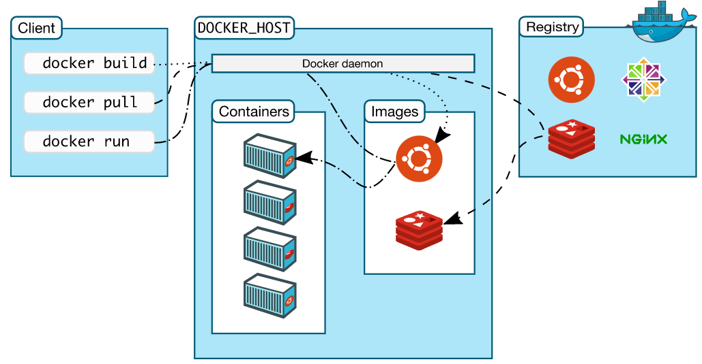

  

# Containerization

### Containerization Architecture

```
┌─────────────────────────────────────────────────────────────────────────┐
│              Containers vs Virtual Machines Architecture                │
└─────────────────────────────────────────────────────────────────────────┘

    Virtual Machines                          Containers
    ────────────────                          ──────────

┌──────────────────────┐              ┌──────────────────────┐
│   App A   │   App B  │              │  App A  │  App B     │
├───────────┼──────────┤              ├─────────┼────────────┤
│  Bins/Libs│ Bins/Libs│              │Bins/Libs│ Bins/Libs  │
├───────────┴──────────┤              ├─────────┴────────────┤
│   Guest OS (Linux)   │              │   Docker Engine      │
├──────────────────────┤              ├──────────────────────┤
│   Guest OS (Ubuntu)  │              │   Host OS (Linux)    │
├──────────────────────┤              ├──────────────────────┤
│    Hypervisor (VMware│              │   Infrastructure     │
├──────────────────────┤              └──────────────────────┘
│   Host OS (Linux)    │
├──────────────────────┤              Benefits:
│   Infrastructure     │              ✓ Lightweight (MBs)
└──────────────────────┘              ✓ Fast startup (seconds)
                                      ✓ Efficient resources
Drawbacks:                            ✓ Portable
✗ Heavy (GBs)                         ✓ Consistent environments
✗ Slow startup (minutes)
✗ Resource intensive
```

### Key Concepts:

- **Containerization** packages applications with their dependencies in isolated environments (containers).
- **Containers** are lightweight, fast, and resource-efficient compared to virtual machines.
- **Docker** is the leading tool for creating and managing containers.
- **Kubernetes** is used for container orchestration across multiple machines.

### **Benefits**:

- Consistent behavior across different environments.
- Efficient use of system resources.
- Fast deployment and scalability.
- Portability across systems.
- Isolation between applications.

---

## DOCKER

### Key Concepts:

- **Docker Containers**: Isolated environments packaging applications.
- **Images**: Templates for creating containers.
- **Dockerfile**: Defines how to build an image.
- **Docker Hub**: Repository for storing and sharing images.
- **Docker Compose:** Tool to manage multi-container applications with a single configuration file.
- **Docker Network**: Connects containers, allowing them to communicate securely.
- **Docker Volume:** persistent storage that decouples data from containers, allowing for data sharing and reuse.

### Benefits:

- **Portability**: Consistent behavior across environments.
- **Efficiency**: Lightweight with minimal overhead.
- **Networking**: Easily link containers for secure communication.
- **Multi-Service Setup**: Docker Compose simplifies multi-container apps.
- **Rapid Deployment**: Fast startup and scaling with minimal resources.

  

### Docker Architecture (Client-Server Model):



- **Docker Client**: Sends commands to the Docker daemon via the Docker API.
- **Docker Daemon (dockerd)**: Manages images, containers, networks, and volumes; communicates with other daemons.
- **Docker Registries**: Store Docker images (e.g., Docker Hub, private registries).

Client and daemon communicate via UNIX sockets or network interfaces using REST API, allowing efficient management of containers across different environments.

---

### Life cycle:


  

- **Created State**: The container has been created but has not started yet.
    - `docker create --name <name-of-container> <docker-image-name>`
    - `docker create --name test nginx`
- **Running State**: The container is actively running and executing processes.
    - `docker run <container-id>`
    - `docker run <container-name>`
- **Paused State**: The container is temporarily suspended, stopping its processes, but can be resumed (unpaused).
    - `docker pause container <container-id or container-name>`
- **Unpaused State**: The container resumes running after being paused.
    - `docker unpause <container-id or container-name>`
- **Stopped State**: The container has been halted, and its processes have stopped, but it still exists.
    - `docker stop <container-id or container-name>`
- **Killed/Deleted State**: The container has been forcefully terminated or deleted, removing its processes and data.
    - `docker kill <container-id or container-name>`

  


---

### Common Docker Commands

### Exploring Docker Information:

- **Show Docker information**:
    
    ```Shell
    docker info
    ```
    

### Managing Containers:

- **List all containers (stopped and running)**:
    
    ```Shell
    docker ps -a
    ```
    
    - `a`, `-all`: Show all containers.

### Managing Images:

- **List all images**:
    
    ```Shell
    docker images
    ```
    
- **List only image IDs**:
    
    ```Shell
    docker images -q
    ```
    
- **List images with SHA values**:
    
    ```Shell
    docker images --digests
    ```
    

### Creating and Running Containers:

- **Check available options for** `**run**` **command**:
    
    ```Shell
    docker run --help
    ```
    
- **Run a container (interactive, terminal, detached)**:
    
    ```Shell
    docker run -itd nginx
    ```
    
    - `i`: Interactive mode.
    - `t`: Allocate a terminal.
    - `d`: Run in detached mode.

To log in (or access) a running container, you can use the `docker exec` command:

- **Login to a Running Container**:
    
    ```Shell
    docker exec -it <container_name> /bin/bash
    ```
    
    If the container uses `sh` instead of `bash`, you can use:
    
    ```Shell
    docker exec -it <container_name> /bin/sh
    ```
    

This opens an interactive terminal session inside the running container.

- **Build an Image from a Dockerfile**:
    
    ```Shell
    docker build -t <image_name:tag> .
    ```
    
- **Tag an Image**:
    
    ```Shell
    docker tag <image_id> <repository/image:tag>
    ```
    
- **Remove an Image**:
    
    ```Shell
    docker rmi <image_name:tag>
    ```
    
- **View Container Logs**:
    
    ```Shell
    docker logs <container_name>
    ```
    
- **Check Container Stats (CPU, Memory)**:
    
    ```Shell
    docker stats
    ```
    
- **Inspect a Container or Image (for detailed metadata)**:
    
    ```Shell
    docker inspect <container_name_or_image>
    ```
    
- **List running containers**:
    
    ```Shell
    docker ps
    ```
    
- **List running, exited, or stopped containers**:
    
    ```Shell
    docker ps -a
    ```
    
- **Login**:
    
    ```Shell
    docker login
    ```
    
- **Logout**:
    
    ```Shell
    docker logout
    ```
    
- **Push an Image**:
    
    ```Shell
    docker push <repository/image:tag>
    ```
    
- **Pull an Image**:
    
    ```Shell
    docker pull <repository/image:tag>
    ```
    

---

### Docker Volumes

Docker volumes are used to persist data generated by and used by Docker containers, storing it outside the container's filesystem.

### Key Concepts:

- **Data Persistence**: Data remains intact even if the container is stopped or removed.
- **Isolation**: Keeps data separate from the container, preventing data loss.
- **Performance**: Better I/O performance compared to the container's writable layer.
- **Sharing**: Allows multiple containers to share the same data.

### Common Commands:

- **Create a Volume**:
    
    ```Shell
    docker volume create <volume_name>
    ```
    
- **List Volumes**:
    
    ```Shell
    docker volume ls
    ```
    
- **Inspect a Volume**:
    
    ```Shell
    docker volume inspect <volume_name>
    ```
    
- **Remove a Volume**:
    
    ```Shell
    docker volume rm <volume_name>
    ```
    
- **Use a Volume in a Container**:
    
    ```Shell
    docker run -v <volume_name>:/path/in/container <image_name>
    ```
    

### Benefits:

- **Durability**: Data remains accessible regardless of the container lifecycle.
- **Backup**: Easy to back up and migrate volumes.
- **Compatibility**: Works with various storage drivers.

  

---

### Docker Networking Overview

Docker networking allows containers to communicate with each other and the outside world. Key network drivers include:

1. **Bridge**: Default, suitable for communication between containers on the same host.
2. **Host**: Uses the host's network directly, bypassing Docker’s virtual network.
3. **Overlay**: For multi-host communication in Docker Swarm.
4. **None**: Isolate the container without network access.
5. **Macvlan**: Assigns a unique MAC address to each container, making it appear as a physical device on the network.

### Common Docker Networking Commands

1. **List Networks**:
    
    ```Shell
    docker network ls
    ```
    
2. **Create a Network**:
    
    ```Shell
    docker network create my_network
    ```
    
3. **Inspect a Network**:
    
    ```Shell
    docker network inspect my_network
    ```
    
4. **Run a Container in a Network**:
    
    ```Shell
    docker run -d --network my_network my_container
    ```
    
5. **Connect/Disconnect a Container from a Network**:
    
    ```Shell
    docker network connect/disconnect my_network my_container
    ```
    
6. **Remove a Network**:
    
    ```Shell
    docker network rm my_network
    ```
    

### Bridge Network Example

1. **Create a Custom Bridge Network**:
    
    ```Shell
    docker network create my_bridge_network
    ```
    
2. **Run Two Containers in the Same Bridge Network**:
    
    ```Shell
    docker run -d --name container1 --network my_bridge_network nginx
    docker run -d --name container2 --network my_bridge_network busybox sleep 1000
    ```
    
3. **Ping Between Containers**:  
    Inside  
    `container2`, you can ping `container1`:
    
    ```Shell
    docker exec -it container2 ping container1
    ```
    

### Macvlan Network Setup

**Macvlan** allows containers to appear as physical devices on your network. Each container gets a unique MAC address, which can simplify communication with external networks.

1. **Create a Macvlan Network**:
    
    ```Shell
    docker network create -d macvlan \\
      --subnet=192.168.1.0/24 \\
      --gateway=192.168.1.1 \\
      -o parent=eth0 my_macvlan_network
    ```
    
    - `-subnet`: The IP address range for the Macvlan network.
    - `-gateway`: The gateway address for external communication.
    - `o parent=eth0`: Specifies the host’s physical network interface (replace `eth0` with the correct interface).
2. **Run a Container in the Macvlan Network**:
    
    ```Shell
    docker run -d --name macvlan_container --network my_macvlan_network busybox sleep 1000
    ```
    
3. **Ping the Container from the Host or Other Devices**:  
    The container will have its own IP on the same subnet as the host, so you can ping it directly:  
    
    ```Shell
    ping 192.168.1.x  # Replace with the container's IP
    ```
    
4. **Communicating Between Macvlan and Host**:  
    By default, containers using Macvlan can't communicate with the host. To enable this, set up a Macvlan bridge interface:  
    
    ```Shell
    ip link add my_macvlan_br link eth0 type macvlan mode bridge
    ip addr add 192.168.1.100/24 dev my_macvlan_br
    ip link set my_macvlan_br up
    ```
    
    This allows the host and Macvlan containers to communicate.
    

### Host and Overlay Networks

- **Host Network** (bypasses Docker's network):
    
    ```Shell
    docker run -d --network host nginx
    ```
    
- **Overlay Network** (multi-host, Swarm mode):
    
    ```Shell
    docker swarm init
    docker network create -d overlay my_overlay_network
    docker service create --name my_service --network my_overlay_network nginx
    ```
    

### Best Practices

- Use **bridge** for internal communication on the same host.
- Use **overlay** for multi-host communication in Docker Swarm.
- Leverage **host** for performance-sensitive applications.
- **Macvlan** is ideal for advanced networking setups where containers need their own MAC address and need to appear as physical devices on the network.

---

### Dockerfile Concepts:

A **Dockerfile** is a script with commands to build a Docker image. Key instructions include:

1. **FROM**: Specifies the base image.
    
    ```Plain
    FROM ubuntu:20.04
    ```
    
2. **RUN**: Executes commands during the image build.
    
    ```Plain
    RUN apt-get update && apt-get install -y python3
    ```
    
3. **COPY**: Copies files from the local system to the image.
    
    ```Plain
    COPY . /app
    ```
    
4. **WORKDIR**: Sets the working directory for subsequent commands.
    
    ```Plain
    WORKDIR /app
    ```
    
5. **CMD**: Command to run when the container starts.
    
    ```Plain
    CMD ["python3", "app.py"]
    ```
    

### Example Dockerfile

```Plain
FROM python:3.9-slim
WORKDIR /app
COPY . .
RUN pip install --no-cache-dir -r requirements.txt
EXPOSE 80
CMD ["python", "app.py"]
```

|   |   |   |
|---|---|---|
|**Instruction**|**Description**|**Example**|
|**ADD**|Adds local or remote files and directories to the image. Can unpack compressed files.|`ADD ./localfile.txt /app/`|
|**ARG**|Defines a variable that users can pass at build-time to the Dockerfile.|`ARG VERSION=1.0`|
|**CMD**|Specifies the default command to run when a container starts. Only one CMD instruction is allowed.|`CMD ["npm", "start"]`|
|**COPY**|Copies files and directories from the source path to the destination path in the image.|`COPY ./src /app/src`|
|**ENTRYPOINT**|Configures a container to run as an executable, cannot be overridden at runtime.|`ENTRYPOINT ["python", "app.py"]`|
|**ENV**|Sets environment variables in the container, accessible at runtime.|`ENV NODE_ENV=production`|
|**EXPOSE**|Documents which ports the container listens on at runtime (informational only).|`EXPOSE 80`|
|**FROM**|Specifies the base image to use for subsequent instructions; the first instruction in a Dockerfile.|`FROM node:14`|
|**HEALTHCHECK**|Tells Docker how to test the container for health.|`HEALTHCHECK CMD curl --fail` `[http://localhost/health](http://localhost/health)`|
|**LABEL**|Adds metadata to an image (e.g., version, description).|`LABEL version="1.0" description="My Docker image"`|
|**MAINTAINER**|Specifies the author of the image (deprecated; use LABEL instead).|`MAINTAINER "Your Name <you@example.com>"`|
|**ONBUILD**|Adds triggers to an image that execute when the image is used as a base for another build.|`ONBUILD RUN echo "This runs on child images"`|
|**RUN**|Executes commands in a new layer on top of the current image and commits the results.|`RUN apt-get update && apt-get install -y python3`|
|**SHELL**|Allows overriding the default shell used for the shell form of commands.|`SHELL ["/bin/bash", "-c"]`|
|**STOPSIGNAL**|Specifies the system call signal sent to the container to stop it.|`STOPSIGNAL SIGKILL`|
|**USER**|Sets the username or UID to use when running the image.|`USER node`|
|**VOLUME**|Creates a mount point for external volumes from the native host or other containers.|`VOLUME ["/data"]`|
|**WORKDIR**|Sets the working directory for subsequent instructions in the Dockerfile.|`WORKDIR /app`|

Let me know if you need further modifications or additional details!

## Multistage Docker Builds

Multistage builds allow you to use multiple `FROM` statements to create smaller, more efficient images. This is useful for separating build environments from runtime environments.

### Example Multistage Dockerfile

```Plain
# First stage: build the Go app
FROM golang:1.17 AS builder
WORKDIR /app
COPY . .
RUN go build -o myapp .

# Second stage: create a small image
FROM alpine:latest
WORKDIR /root/
COPY --from=builder /app/myapp .
EXPOSE 8080
CMD ["./myapp"]
```

### Summary

- **Dockerfile**: Automates image creation.
- **Multistage Builds**: Optimize image size and security by separating build and runtime stages.

  

---

## What is Docker Compose?

**Docker Compose** is a tool for defining and running multi-container Docker applications using a single `docker-compose.yml` file. It allows you to manage complex applications with multiple services, networks, and volumes.

## Key Concepts

### 1. Services

A **service** is a container running a specific application. Each service is defined in the `docker-compose.yml` file.

### 2. Versioning

The `version` key specifies the Compose file format version. Use the latest version to access new features.

### 3. Networks

Compose automatically creates a network for your services, allowing them to communicate. You can define custom networks if needed.

### 4. Volumes

**Volumes** are used for data persistence, allowing you to keep data even when containers stop or are removed. You can mount host directories or named volumes.

## Basic Structure of a `docker-compose.yml`

Here’s a simplified structure of a `docker-compose.yml` file:

```YAML
version: '3'  # Compose file version

services:  # Define services
  service_name:
    image: image_name:tag  # Use an existing image
    build: ./path/to/Dockerfile  # Build from a Dockerfile
    ports:
      - "host_port:container_port"  # Port mapping
    volumes:
      - host_path:container_path  # Volume mapping
    environment:  # Set environment variables
      - ENV_VAR_NAME=value
    depends_on:  # Service dependencies
      - another_service_name
```

## Example `docker-compose.yml`

Here’s a practical example for a Flask web app with a Redis database:

```YAML
version: '3'

services:
  web:
    build: ./web  # Build context for web service
    ports:
      - "5000:5000"  # Map host port 5000 to container port 5000
    depends_on:
      - redis

  redis:
    image: "redis:alpine"  # Use the official Redis image
```

### Explanation of Example

- **web**: This service builds from the Dockerfile located in the `./web` directory and maps port 5000 on the host to port 5000 in the container.
- **redis**: This service uses a pre-built Redis image from Docker Hub.

## Common Commands

### Start Services

To start all services defined in the `docker-compose.yml` file:

```Shell
docker compose up  # Run in the foreground
docker compose up -d  # Run in detached mode (background)
```

### Stop Services

To stop and remove all containers defined in the file:

```Shell
docker compose down
```

### View Logs

To check the logs of running services:

```Shell
docker compose logs  # Shows logs for all services
```

### Execute Commands in Services

Run commands in a specific service container:

```Shell
docker compose exec service_name command
```

Example to open a shell in the web service:

```Shell
docker compose exec web sh
```

## Managing Multiple Environments

You can manage different environments (like development and production) using multiple YAML files. Use the `-f` flag to specify which file to use:

```Shell
docker compose -f docker-compose.dev.yml up
```

## Conclusion

Docker Compose simplifies the management of multi-container applications. By defining services, networks, and volumes in a single file, it enables you to easily start, stop, and manage complex applications with straightforward commands.

  

---